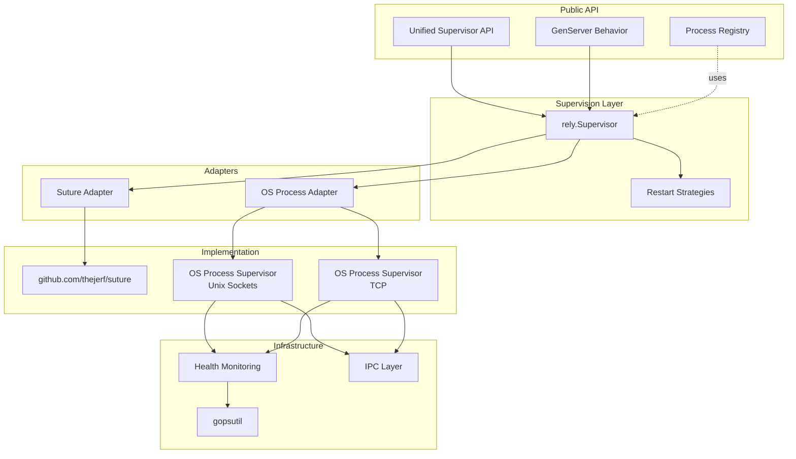
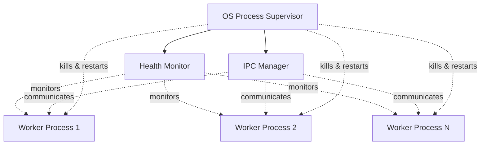
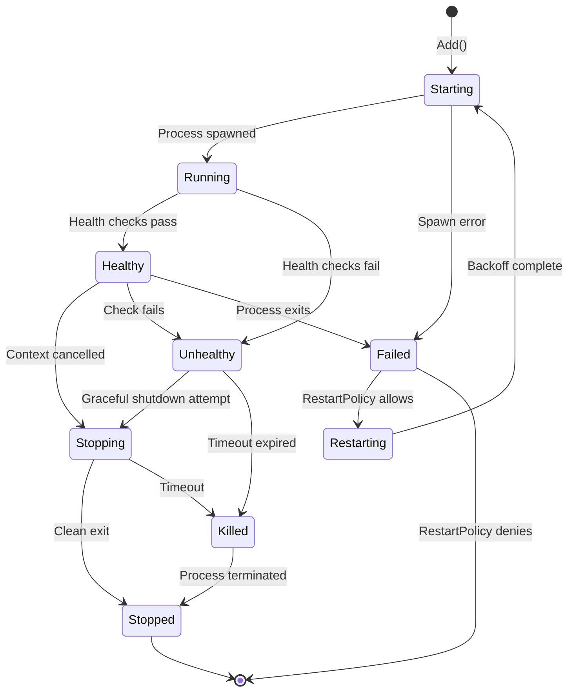

# zylisp/rely: Erlang-Style Supervision for Go

**Version**: 1.0.0  
**Date**: October 2025  
**Status**: Design Specification

---

## Table of Contents

1. [Executive Summary](#1-executive-summary)
2. [Vision and Motivation](#2-vision-and-motivation)
3. [Core Architecture](#3-core-architecture)
4. [Unified Supervision Model](#4-unified-supervision-model)
5. [OS Process Supervision](#5-os-process-supervision)
6. [Suture Integration](#6-suture-integration)
7. [Restart Strategies](#7-restart-strategies)
8. [GenServer Behavior](#8-genserver-behavior)
9. [Process Registry](#9-process-registry)
10. [Health Monitoring](#10-health-monitoring)
11. [IPC and Network Communication](#11-ipc-and-network-communication)
12. [API Reference](#12-api-reference)
13. [Implementation Plan](#13-implementation-plan)
14. [Future Enhancements](#14-future-enhancements)
15. [Appendix](#15-appendix)

---

## 1. Executive Summary

### 1.1 Overview

`zylisp/rely` is a general-purpose Go library that brings Erlang/OTP-style reliability patterns to Go applications. It provides unified supervision trees that can manage both in-process goroutines and separate OS processes, enabling fault-tolerant system design with automatic recovery.

### 1.2 Key Features

- ✅ **Unified Supervision Trees**: Single API for managing goroutines and OS processes
- ✅ **Complete Erlang Restart Strategies**: OneForOne, OneForAll, RestForOne, SimpleOneForOne
- ✅ **OS Process Supervision**: True process isolation with memory management
- ✅ **Multiple IPC Mechanisms**: Unix sockets and TCP with pluggable architecture
- ✅ **GenServer Behavior**: Synchronous and asynchronous message patterns
- ✅ **Process Registry**: Named process lookup and management
- ✅ **Health Monitoring**: Liveness, readiness, and custom health checks
- ✅ **Production Ready**: Built on battle-tested Suture foundation
- ✅ **General Purpose**: Usable by any Go project, not Zylisp-specific

### 1.3 Design Principles

1. **Erlang Compatibility**: Implement OTP supervision patterns faithfully
2. **Composability**: Supervision trees can contain other supervision trees
3. **Flexibility**: Support both goroutines and OS processes
4. **Clean Abstraction**: Hide complexity behind simple interfaces
5. **Zero Dependencies**: Minimal external dependencies (only Suture + gopsutil)
6. **Cross-Platform**: Works on macOS, Linux, and Windows

### 1.4 Target Audience

- **Primary**: Zylisp language implementation (REPL workers, compiler processes)
- **Secondary**: Any Go application needing:
  - Fault-tolerant service management
  - OS process supervision
  - Plugin memory management
  - Reliable distributed systems
  - Long-running server processes

---

## 2. Vision and Motivation

### 2.1 The Problem Space

**Goroutine Limitations**:
- Share process memory (can't isolate memory leaks)
- Cannot be forcibly killed
- Go plugins cannot be unloaded (permanent memory leak)
- GC pauses affect entire process

**OS Process Challenges**:
- Complex lifecycle management
- No standard supervision library in Go
- Platform-specific APIs for monitoring
- Difficult to build reliable process trees

**Existing Solutions**:
- Suture: Excellent for goroutines, but doesn't handle OS processes
- System process managers (systemd, supervisor): External tools, no Go integration
- Custom solutions: Every project reinvents the wheel

### 2.2 The Erlang Model

Erlang/OTP has proven, over 30+ years in production telecom systems, that:

1. **"Let It Crash"** philosophy works for building reliable systems
2. **Supervision trees** enable automatic recovery
3. **Process isolation** prevents cascading failures
4. **Clear restart strategies** make failure handling predictable
5. **Language-level support** makes patterns accessible

### 2.3 Our Solution

`zylisp/rely` brings OTP patterns to Go by:

1. **Unifying goroutine and OS process supervision** under one API
2. **Building on Suture** for proven goroutine supervision
3. **Adding OS process supervision** with true memory isolation
4. **Implementing complete Erlang restart strategies**
5. **Providing GenServer and other OTP behaviors**
6. **Making it general-purpose** so any Go project benefits

### 2.4 Use Cases

**Zylisp REPL Architecture**:
```
CLI Supervisor
├── REPL Server (goroutine)
│   ├── Session Manager (goroutine)
│   └── Worker Supervisor (OS process supervisor)
│       ├── Worker 1 (OS process - loads plugins)
│       ├── Worker 2 (OS process - loads plugins)
│       └── Worker N (OS process - loads plugins)
└── REPL Client (goroutine)
```

**General Web Service**:
```
Application Supervisor
├── HTTP Server (goroutine)
├── Background Jobs (goroutine pool)
└── Image Processing (OS process pool)
    ├── Worker 1 (heavy memory usage)
    ├── Worker 2 (heavy memory usage)
    └── Worker N (heavy memory usage)
```

**Compiler Service**:
```
Compiler Supervisor
├── API Server (goroutine)
└── Compiler Workers (OS processes)
    ├── Go Compiler (isolated process)
    ├── Rust Compiler (isolated process)
    └── C++ Compiler (isolated process)
```

---

## 3. Core Architecture

### 3.1 System Overview



### 3.2 Core Components

#### Supervised Interface

The fundamental abstraction that enables unified supervision:

```go
type Supervised interface {
    Serve(ctx context.Context) error
}
```

**All supervised entities implement this interface**:
- Suture supervisors
- OS process supervisors
- Individual services (goroutines)
- GenServer instances
- Custom implementations

#### rely.Supervisor

The main supervision tree implementation:

```go
type Supervisor struct {
    children  []Child
    strategy  RestartStrategy
    options   SupervisorOptions
}

type Child struct {
    id       string
    service  Supervised
    restart  RestartPolicy
}
```

#### Restart Strategies

Erlang-compatible strategies:

- **OneForOne**: Restart only the failed child
- **OneForAll**: Restart all children when any child fails
- **RestForOne**: Restart failed child and all children started after it
- **SimpleOneForOne**: Dynamic pool of identical workers

#### Adapters

**Suture Adapter**:
```go
type SutureAdapter struct {
    supervisor *suture.Supervisor
}

func (s *SutureAdapter) Serve(ctx context.Context) error
```

**OS Process Adapter**:
```go
type OSProcessAdapter struct {
    supervisor OSProcessSupervisor
}

func (o *OSProcessAdapter) Serve(ctx context.Context) error
```

### 3.3 Layered Architecture

```
┌─────────────────────────────────────────────────┐
│  Application Layer                              │
│  (User Code)                                    │
└─────────────────────────────────────────────────┘
                    │
                    ▼
┌─────────────────────────────────────────────────┐
│  Public API Layer                               │
│  rely.Supervisor, GenServer, Registry           │
└─────────────────────────────────────────────────┘
                    │
                    ▼
┌─────────────────────────────────────────────────┐
│  Supervision Layer                              │
│  Restart Strategies, Child Management           │
└─────────────────────────────────────────────────┘
                    │
                    ▼
┌─────────────────────────────────────────────────┐
│  Adapter Layer                                  │
│  Suture Adapter, OS Process Adapter             │
└─────────────────────────────────────────────────┘
                    │
                    ▼
┌─────────────────────────────────────────────────┐
│  Implementation Layer                           │
│  Suture, Unix Sockets, TCP, Health Monitoring   │
└─────────────────────────────────────────────────┘
```

**Benefits of this architecture**:
- Clear separation of concerns
- Easy to test each layer
- Can add new supervisor types (e.g., Docker containers)
- Users can implement custom Supervised types

---

## 4. Unified Supervision Model

### 4.1 The Supervised Interface

```go
// Supervised is the core interface that all supervised entities implement.
// This enables unified supervision trees containing both goroutines and OS processes.
type Supervised interface {
    // Serve runs the service until the context is cancelled or an error occurs.
    // Returning nil indicates clean shutdown.
    // Returning an error triggers restart according to the supervisor's strategy.
    Serve(ctx context.Context) error
}
```

### 4.2 Supervisor API

```go
// Supervisor manages a supervision tree with a restart strategy.
type Supervisor struct {
    // ... internal fields
}

// NewSupervisor creates a new supervisor with the given strategy.
func NewSupervisor(strategy RestartStrategy, opts ...SupervisorOption) *Supervisor

// Add adds a child to the supervision tree.
func (s *Supervisor) Add(id string, service Supervised, policy RestartPolicy) error

// Remove removes a child from the supervision tree.
func (s *Supervisor) Remove(id string) error

// Serve implements Supervised, allowing supervisors to be nested.
func (s *Supervisor) Serve(ctx context.Context) error

// Children returns information about all current children.
func (s *Supervisor) Children() []ChildInfo

// Restart explicitly restarts a child.
func (s *Supervisor) Restart(id string) error
```

### 4.3 Restart Policies

```go
type RestartPolicy int

const (
    // Permanent: Always restart the child when it terminates
    Permanent RestartPolicy = iota
    
    // Temporary: Never restart the child
    Temporary
    
    // Transient: Restart only if child terminates abnormally
    Transient
)
```

### 4.4 Composition Example

```go
func main() {
    // Create top-level supervisor with OneForAll strategy
    topSupervisor := rely.NewSupervisor(rely.OneForAll)

    // Create a Suture supervisor for goroutines
    sutureSuper := suture.New("goroutine-services", suture.Spec{})
    sutureSuper.Add(myGoroutineService1)
    sutureSuper.Add(myGoroutineService2)
    
    // Wrap it in an adapter
    sutureAdapter := rely.NewSutureAdapter(sutureSuper)
    
    // Create an OS process supervisor for heavy workers
    osSuper := rely.NewOSProcessSupervisor(rely.UnixSocketIPC)
    osSuper.Add("worker-1", &WorkerSpec{
        Command: []string{"./worker"},
        MemoryLimitMB: 500,
    })
    osSuper.Add("worker-2", &WorkerSpec{
        Command: []string{"./worker"},
        MemoryLimitMB: 500,
    })
    
    // Wrap it in an adapter
    osAdapter := rely.NewOSProcessAdapter(osSuper)
    
    // Add both to top-level supervisor
    topSupervisor.Add("goroutine-supervisor", sutureAdapter, rely.Permanent)
    topSupervisor.Add("os-process-supervisor", osAdapter, rely.Permanent)
    
    // Start the entire tree
    ctx := context.Background()
    if err := topSupervisor.Serve(ctx); err != nil {
        log.Fatal(err)
    }
}
```

### 4.5 Cascading Restart Behavior

When a child fails, the restart strategy determines the response:

**OneForOne Strategy**:
```
Worker A fails
  └─> Supervisor restarts only Worker A
```

**OneForAll Strategy**:
```
Worker A fails
  ├─> Supervisor stops Worker B
  ├─> Supervisor stops Worker C
  ├─> Supervisor restarts Worker A
  ├─> Supervisor restarts Worker B
  └─> Supervisor restarts Worker C
```

**RestForOne Strategy**:
```
Worker B fails (started after A, before C)
  ├─> Supervisor leaves Worker A running
  ├─> Supervisor stops Worker C
  ├─> Supervisor restarts Worker B
  └─> Supervisor restarts Worker C
```

**Nested Supervisors**:
```
Top Supervisor (OneForAll)
├── Suture Supervisor
│   ├── Goroutine A (fails) ◄── Failure starts here
│   ├── Goroutine B
│   └── Goroutine C
└── OS Process Supervisor
    ├── Process X
    └── Process Y

Flow:
1. Goroutine A fails
2. Suture Supervisor handles restart (per its strategy)
3. If Suture Supervisor itself fails, Top Supervisor sees it
4. Top Supervisor applies OneForAll:
   - Stops OS Process Supervisor (kills X, Y)
   - Stops Suture Supervisor (stops A, B, C)
   - Restarts Suture Supervisor (starts A, B, C)
   - Restarts OS Process Supervisor (spawns X, Y)
```

---

## 5. OS Process Supervision

### 5.1 Architecture



### 5.2 Core API

```go
// OSProcessSupervisor manages OS process lifecycle with health monitoring.
type OSProcessSupervisor struct {
    strategy RestartStrategy
    ipc      IPCMechanism
    monitor  HealthMonitor
}

// WorkerSpec defines how to start and manage a worker process.
type WorkerSpec struct {
    // Command and arguments to execute
    Command []string
    
    // Working directory
    WorkingDir string
    
    // Environment variables
    Env []string
    
    // Resource limits
    MemoryLimitMB uint64
    MaxRequests   int
    
    // Health checks
    HealthCheck HealthCheckConfig
    
    // Restart policy
    Restart RestartPolicy
}

// HealthCheckConfig defines health monitoring parameters.
type HealthCheckConfig struct {
    // Enable liveness checks (heartbeat)
    LivenessEnabled bool
    LivenessInterval time.Duration
    LivenessTimeout time.Duration
    
    // Enable readiness checks
    ReadinessEnabled bool
    ReadinessInterval time.Duration
    
    // Custom health check callback
    CustomCheck func(pid int32) error
}

// NewOSProcessSupervisor creates a new OS process supervisor.
func NewOSProcessSupervisor(
    strategy RestartStrategy,
    ipc IPCMechanism,
    opts ...OSProcessOption,
) *OSProcessSupervisor

// Add adds a worker process to the supervision tree.
func (s *OSProcessSupervisor) Add(id string, spec *WorkerSpec) error

// Remove removes and stops a worker process.
func (s *OSProcessSupervisor) Remove(id string) error

// Serve implements Supervised interface.
func (s *OSProcessSupervisor) Serve(ctx context.Context) error
```

### 5.3 Worker Lifecycle



### 5.4 Memory Management

```go
// MemoryMonitor tracks process memory usage.
type MemoryMonitor struct {
    pid           int32
    thresholdMB   uint64
    checkInterval time.Duration
}

func (m *MemoryMonitor) Check() (uint64, error) {
    proc, err := process.NewProcess(m.pid)
    if err != nil {
        return 0, err
    }
    
    memInfo, err := proc.MemoryInfo()
    if err != nil {
        return 0, err
    }
    
    rssМB := memInfo.RSS / 1024 / 1024
    
    if rssМB > m.thresholdMB {
        return rssМB, ErrMemoryThresholdExceeded
    }
    
    return rssМB, nil
}
```

### 5.5 Graceful Shutdown

```go
// Shutdown attempts graceful shutdown, then forceful if needed.
func (w *Worker) Shutdown(timeout time.Duration) error {
    // 1. Send shutdown signal via IPC
    if err := w.sendShutdown(); err != nil {
        return w.forceKill()
    }
    
    // 2. Wait for clean exit
    done := make(chan error, 1)
    go func() {
        done <- w.cmd.Wait()
    }()
    
    select {
    case err := <-done:
        return err
    case <-time.After(timeout):
        // 3. Graceful timeout - force kill
        return w.forceKill()
    }
}

func (w *Worker) forceKill() error {
    if w.cmd.Process != nil {
        return w.cmd.Process.Kill()
    }
    return nil
}
```

---

## 6. Suture Integration

### 6.1 Adapter Implementation

```go
// SutureAdapter wraps a Suture supervisor to implement Supervised.
type SutureAdapter struct {
    supervisor *suture.Supervisor
}

// NewSutureAdapter creates an adapter for a Suture supervisor.
func NewSutureAdapter(supervisor *suture.Supervisor) *SutureAdapter {
    return &SutureAdapter{supervisor: supervisor}
}

// Serve implements Supervised by delegating to Suture.
func (s *SutureAdapter) Serve(ctx context.Context) error {
    // Start Suture supervisor in background
    s.supervisor.ServeBackground(ctx)
    
    // Wait for context cancellation
    <-ctx.Done()
    
    // Stop Suture supervisor
    s.supervisor.Stop()
    
    return ctx.Err()
}
```

### 6.2 Feature Mapping

| Erlang/OTP | rely | Suture |
|------------|------|--------|
| OneForOne | ✅ | ✅ |
| OneForAll | ✅ | ❌ (rely implements) |
| RestForOne | ✅ | ❌ (rely implements) |
| SimpleOneForOne | ✅ | ❌ (rely implements) |
| Restart intensity | ✅ | ✅ |
| Backoff | ✅ | ✅ |
| Logging hooks | Later | ✅ |

### 6.3 Extended Restart Strategies

Since Suture only implements OneForOne, rely will extend it:

```go
// ExtendedSutureSupervisor adds full restart strategies to Suture.
type ExtendedSutureSupervisor struct {
    supervisor *suture.Supervisor
    strategy   RestartStrategy
    children   []suture.ServiceToken
}

// When a child fails, apply the strategy
func (e *ExtendedSutureSupervisor) handleFailure(failedToken suture.ServiceToken) {
    switch e.strategy {
    case OneForOne:
        // Let Suture handle it (default behavior)
        
    case OneForAll:
        // Stop all children
        for _, token := range e.children {
            e.supervisor.Remove(token)
        }
        // Restart all children
        for _, service := range e.originalServices {
            e.supervisor.Add(service)
        }
        
    case RestForOne:
        // Find failed child index
        failedIndex := e.findChildIndex(failedToken)
        // Stop and restart this child and all after it
        for i := failedIndex; i < len(e.children); i++ {
            e.supervisor.Remove(e.children[i])
            e.supervisor.Add(e.originalServices[i])
        }
    }
}
```

---

## 7. Restart Strategies

### 7.1 Strategy Definitions

```go
type RestartStrategy int

const (
    // OneForOne: When a child process terminates, only that process is restarted.
    OneForOne RestartStrategy = iota
    
    // OneForAll: When a child process terminates, all other children are
    // terminated and then all children are restarted.
    OneForAll
    
    // RestForOne: When a child process terminates, the rest of the children
    // (those started after the terminated child) are terminated, and then
    // the terminated child and the rest of the children are restarted.
    RestForOne
    
    // SimpleOneForOne: A simplified OneForOne supervisor where all children
    // are dynamically added instances of the same process type.
    SimpleOneForOne
)
```

### 7.2 Strategy Behavior Details

#### OneForOne

**Use Case**: Independent services where failure of one doesn't affect others.

**Behavior**:
- Failed child is restarted
- Other children continue running
- Most lightweight strategy

**Example**:
```go
supervisor := rely.NewSupervisor(rely.OneForOne)
supervisor.Add("db-connection", dbService, rely.Permanent)
supervisor.Add("cache", cacheService, rely.Permanent)
supervisor.Add("logger", logService, rely.Permanent)

// If cache fails, only cache is restarted
```

#### OneForAll

**Use Case**: Tightly coupled services where consistency requires all to restart together.

**Behavior**:
- When any child fails, ALL children are stopped
- Then ALL children are restarted
- Ensures consistent state across services

**Example**:
```go
supervisor := rely.NewSupervisor(rely.OneForAll)
supervisor.Add("transaction-manager", txService, rely.Permanent)
supervisor.Add("lock-manager", lockService, rely.Permanent)
supervisor.Add("state-machine", stateService, rely.Permanent)

// If transaction-manager fails, all three restart for consistency
```

#### RestForOne

**Use Case**: Pipeline or dependency chain where later services depend on earlier ones.

**Behavior**:
- Failed child is restarted
- All children started AFTER the failed child are also restarted
- Children started BEFORE continue running

**Example**:
```go
supervisor := rely.NewSupervisor(rely.RestForOne)
supervisor.Add("database", dbService, rely.Permanent)          // 1st
supervisor.Add("cache", cacheService, rely.Permanent)          // 2nd
supervisor.Add("api-server", apiService, rely.Permanent)       // 3rd

// If cache fails:
//   - database keeps running
//   - cache restarts
//   - api-server restarts (depends on cache)
```

#### SimpleOneForOne

**Use Case**: Dynamic worker pools with identical workers.

**Behavior**:
- All workers are instances of the same type
- Workers can be dynamically added/removed
- When a worker fails, only that worker restarts
- Optimized for pools with many workers

**Example**:
```go
supervisor := rely.NewSupervisor(rely.SimpleOneForOne)

// Define worker template
workerSpec := &WorkerSpec{
    Command: []string{"./worker"},
    MemoryLimitMB: 500,
}

// Dynamically add workers
for i := 0; i < 10; i++ {
    supervisor.AddWorker(fmt.Sprintf("worker-%d", i), workerSpec)
}

// Workers can be added/removed during runtime
supervisor.AddWorker("worker-11", workerSpec)
supervisor.RemoveWorker("worker-5")
```

### 7.3 Restart Intensity and Backoff

```go
type SupervisorOptions struct {
    // Maximum number of restarts allowed in the time window
    MaxRestarts int
    
    // Time window for counting restarts
    MaxTime time.Duration
    
    // Initial backoff duration
    InitialBackoff time.Duration
    
    // Maximum backoff duration
    MaxBackoff time.Duration
    
    // Backoff multiplier (exponential backoff)
    BackoffMultiplier float64
}

// Default values
var DefaultSupervisorOptions = SupervisorOptions{
    MaxRestarts:       5,
    MaxTime:           10 * time.Second,
    InitialBackoff:    1 * time.Second,
    MaxBackoff:        30 * time.Second,
    BackoffMultiplier: 2.0,
}
```

**Behavior**:
- If a child restarts more than `MaxRestarts` times in `MaxTime`, the supervisor terminates
- Backoff increases exponentially: 1s → 2s → 4s → 8s → 16s → 30s (capped)
- Prevents restart storms that consume resources

---

## 8. GenServer Behavior

### 8.1 Overview

GenServer (Generic Server) is a behavior pattern for processes that handle synchronous calls, asynchronous casts, and maintain internal state.

### 8.2 Interface

```go
// GenServer defines the behavior for a generic server process.
type GenServer interface {
    // Init is called when the server starts.
    Init() error
    
    // HandleCall handles synchronous requests.
    // The request is sent by Call(), and this function must return a response.
    HandleCall(request interface{}) (response interface{}, err error)
    
    // HandleCast handles asynchronous messages.
    // The message is sent by Cast(), and no response is expected.
    HandleCast(message interface{}) error
    
    // HandleInfo handles all other messages (e.g., from other processes).
    HandleInfo(message interface{}) error
    
    // Terminate is called when the server is shutting down.
    Terminate(reason error) error
}

// GenServerBase provides a base implementation that can be embedded.
type GenServerBase struct{}

func (g *GenServerBase) Init() error                                      { return nil }
func (g *GenServerBase) HandleCall(request interface{}) (interface{}, error) { return nil, ErrNotImplemented }
func (g *GenServerBase) HandleCast(message interface{}) error             { return nil }
func (g *GenServerBase) HandleInfo(message interface{}) error             { return nil }
func (g *GenServerBase) Terminate(reason error) error                     { return nil }
```

### 8.3 Client API

```go
// Call sends a synchronous request and waits for a response.
func Call(server GenServer, request interface{}, timeout time.Duration) (interface{}, error)

// Cast sends an asynchronous message (fire and forget).
func Cast(server GenServer, message interface{}) error

// Start starts a GenServer under supervision.
func Start(server GenServer, options ...GenServerOption) (Supervised, error)

// StartLink starts a GenServer and links it to the current process.
func StartLink(server GenServer, options ...GenServerOption) (Supervised, error)
```

### 8.4 Example: Counter Service

```go
type Counter struct {
    rely.GenServerBase
    count int
    mu    sync.Mutex
}

func (c *Counter) Init() error {
    c.count = 0
    return nil
}

func (c *Counter) HandleCall(request interface{}) (interface{}, error) {
    c.mu.Lock()
    defer c.mu.Unlock()
    
    switch req := request.(type) {
    case "increment":
        c.count++
        return c.count, nil
        
    case "get":
        return c.count, nil
        
    default:
        return nil, fmt.Errorf("unknown request: %v", req)
    }
}

func (c *Counter) HandleCast(message interface{}) error {
    c.mu.Lock()
    defer c.mu.Unlock()
    
    switch msg := message.(type) {
    case int:
        c.count = msg
        return nil
        
    default:
        return nil
    }
}

// Usage
func main() {
    counter := &Counter{}
    server, err := rely.Start(counter)
    if err != nil {
        log.Fatal(err)
    }
    
    // Synchronous call
    result, err := rely.Call(server, "increment", 5*time.Second)
    fmt.Println("Count:", result) // Count: 1
    
    // Asynchronous cast
    rely.Cast(server, 42)
}
```

### 8.5 GenServer with OS Processes

For OS process GenServers, the IPC layer handles message passing:

```go
type RemoteGenServer struct {
    process *Worker
    ipc     IPCClient
}

func (r *RemoteGenServer) HandleCall(request interface{}) (interface{}, error) {
    // Serialize request
    data, err := json.Marshal(request)
    if err != nil {
        return nil, err
    }
    
    // Send via IPC
    response, err := r.ipc.Call(data)
    if err != nil {
        return nil, err
    }
    
    // Deserialize response
    var result interface{}
    if err := json.Unmarshal(response, &result); err != nil {
        return nil, err
    }
    
    return result, nil
}
```

---

## 9. Process Registry

### 9.1 Overview

The process registry provides named process lookup, enabling processes to find each other by name rather than PID or reference.

### 9.2 API

```go
// Registry manages named processes.
type Registry struct {
    // ... internal
}

// Register registers a process with a name.
func (r *Registry) Register(name string, process Supervised) error

// Unregister removes a process from the registry.
func (r *Registry) Unregister(name string) error

// Lookup finds a process by name.
func (r *Registry) Lookup(name string) (Supervised, error)

// WhereIs returns the process registered under name, or nil.
func (r *Registry) WhereIs(name string) Supervised

// RegisteredNames returns all registered names.
func (r *Registry) RegisteredNames() []string

// Global registry instance
var DefaultRegistry = NewRegistry()

// Convenience functions using the default registry
func Register(name string, process Supervised) error
func Unregister(name string) error
func Lookup(name string) (Supervised, error)
func WhereIs(name string) Supervised
```

### 9.3 Usage Example

```go
// Start a GenServer
counter := &Counter{}
server, _ := rely.Start(counter)

// Register it with a name
rely.Register("counter", server)

// Later, from anywhere in the application
counterService := rely.WhereIs("counter")
if counterService != nil {
    result, _ := rely.Call(counterService, "increment", 5*time.Second)
    fmt.Println(result)
}
```

### 9.4 Implementation Notes

- Thread-safe concurrent access
- Automatic cleanup when processes terminate
- Optional monitoring: get notified when a registered process dies
- Supports both local (goroutine) and remote (OS process) registration

---

## 10. Health Monitoring

### 10.1 Health Check Types

```go
// HealthCheckType defines types of health checks.
type HealthCheckType int

const (
    // LivenessCheck: Is the process alive?
    LivenessCheck HealthCheckType = iota
    
    // ReadinessCheck: Is the process ready to accept work?
    ReadinessCheck
    
    // CustomCheck: User-defined health check
    CustomCheck
)
```

### 10.2 Health Monitor Interface

```go
// HealthMonitor manages health checks for a worker process.
type HealthMonitor interface {
    // StartMonitoring begins health checks.
    StartMonitoring(ctx context.Context) error
    
    // IsHealthy returns the current health status.
    IsHealthy() bool
    
    // HealthReport returns detailed health information.
    HealthReport() HealthReport
}

// HealthReport contains health check results.
type HealthReport struct {
    Timestamp       time.Time
    ProcessID       int32
    MemoryUsageMB   uint64
    MemoryLimitMB   uint64
    RequestCount    int
    LivenessStatus  HealthStatus
    ReadinessStatus HealthStatus
    CustomStatus    HealthStatus
    LastError       error
}

// HealthStatus represents the result of a health check.
type HealthStatus struct {
    Healthy       bool
    LastCheckTime time.Time
    Failures      int
    Message       string
}
```

### 10.3 Liveness Checks (Heartbeat)

```go
type LivenessMonitor struct {
    pid      int32
    interval time.Duration
    timeout  time.Duration
    ipc      IPCClient
}

func (l *LivenessMonitor) Check() error {
    // Send ping
    response, err := l.ipc.CallWithTimeout("ping", l.timeout)
    if err != nil {
        return fmt.Errorf("liveness check failed: %w", err)
    }
    
    if response != "pong" {
        return errors.New("unexpected response to ping")
    }
    
    return nil
}

// Worker process must implement:
func (w *WorkerProcess) HandleCall(request interface{}) (interface{}, error) {
    switch request {
    case "ping":
        return "pong", nil
    // ... other handlers
    }
}
```

### 10.4 Readiness Checks

```go
type ReadinessMonitor struct {
    pid      int32
    interval time.Duration
    ipc      IPCClient
}

func (r *ReadinessMonitor) Check() error {
    response, err := r.ipc.Call("ready")
    if err != nil {
        return fmt.Errorf("readiness check failed: %w", err)
    }
    
    ready, ok := response.(bool)
    if !ok || !ready {
        return errors.New("process not ready")
    }
    
    return nil
}

// Worker process must implement:
func (w *WorkerProcess) HandleCall(request interface{}) (interface{}, error) {
    switch request {
    case "ready":
        // Check if worker is initialized and ready for work
        return w.isReady(), nil
    // ... other handlers
    }
}
```

### 10.5 Custom Health Checks

```go
type CustomHealthCheck func(pid int32) error

// Example: Check if process has a specific file open
func checkDatabaseConnection(pid int32) error {
    proc, err := process.NewProcess(pid)
    if err != nil {
        return err
    }
    
    openFiles, err := proc.OpenFiles()
    if err != nil {
        return err
    }
    
    for _, file := range openFiles {
        if strings.Contains(file.Path, "database.db") {
            return nil
        }
    }
    
    return errors.New("database connection not found")
}

// Usage
spec := &WorkerSpec{
    Command: []string{"./worker"},
    HealthCheck: HealthCheckConfig{
        CustomCheck: checkDatabaseConnection,
    },
}
```

### 10.6 Health Check Composition

```go
func (h *HealthMonitor) RunChecks(ctx context.Context) {
    ticker := time.NewTicker(h.interval)
    defer ticker.Stop()
    
    for {
        select {
        case <-ctx.Done():
            return
            
        case <-ticker.C:
            // Run all enabled checks
            if h.config.LivenessEnabled {
                if err := h.checkLiveness(); err != nil {
                    h.report.LivenessStatus.Failures++
                    h.report.LastError = err
                }
            }
            
            if h.config.ReadinessEnabled {
                if err := h.checkReadiness(); err != nil {
                    h.report.ReadinessStatus.Failures++
                }
            }
            
            if h.config.CustomCheck != nil {
                if err := h.config.CustomCheck(h.pid); err != nil {
                    h.report.CustomStatus.Failures++
                }
            }
            
            // Check memory
            if h.memoryLimitMB > 0 {
                memUsage, err := h.checkMemory()
                if err != nil || memUsage > h.memoryLimitMB {
                    h.triggerRestart("memory limit exceeded")
                }
            }
        }
    }
}
```

---

## 11. IPC and Network Communication

### 11.1 IPC Mechanism Interface

```go
// IPCMechanism defines how supervisor and worker communicate.
type IPCMechanism interface {
    // Start initializes the IPC mechanism.
    Start(ctx context.Context) error
    
    // Connect establishes a connection to a worker.
    Connect(workerID string) (IPCClient, error)
    
    // Listen waits for worker connections (for worker-initiated connections).
    Listen() (IPCServer, error)
    
    // Close shuts down the IPC mechanism.
    Close() error
}

// IPCClient represents the supervisor's side of the connection.
type IPCClient interface {
    // Call sends a synchronous request and waits for response.
    Call(request interface{}) (response interface{}, err error)
    
    // CallWithTimeout sends a request with a timeout.
    CallWithTimeout(request interface{}, timeout time.Duration) (interface{}, error)
    
    // Send sends an asynchronous message (no response expected).
    Send(message interface{}) error
    
    // Close closes the connection.
    Close() error
}

// IPCServer represents the worker's side of the connection.
type IPCServer interface {
    // Accept waits for and accepts a request.
    Accept() (request interface{}, respond func(interface{}) error, err error)
    
    // Close closes the server.
    Close() error
}
```

### 11.2 Unix Socket Implementation

```go
// UnixSocketIPC implements IPCMechanism using Unix domain sockets.
type UnixSocketIPC struct {
    socketDir string
    listeners map[string]*net.UnixListener
}

func NewUnixSocketIPC(socketDir string) *UnixSocketIPC {
    return &UnixSocketIPC{
        socketDir: socketDir,
        listeners: make(map[string]*net.UnixListener),
    }
}

func (u *UnixSocketIPC) Start(ctx context.Context) error {
    // Create socket directory if it doesn't exist
    return os.MkdirAll(u.socketDir, 0755)
}

func (u *UnixSocketIPC) Connect(workerID string) (IPCClient, error) {
    socketPath := filepath.Join(u.socketDir, workerID+".sock")
    
    conn, err := net.DialUnix("unix", nil, &net.UnixAddr{
        Name: socketPath,
        Net:  "unix",
    })
    if err != nil {
        return nil, err
    }
    
    return &UnixSocketClient{conn: conn}, nil
}

// UnixSocketClient implements IPCClient.
type UnixSocketClient struct {
    conn *net.UnixConn
    mu   sync.Mutex
}

func (c *UnixSocketClient) Call(request interface{}) (interface{}, error) {
    c.mu.Lock()
    defer c.mu.Unlock()
    
    // Serialize request
    data, err := json.Marshal(request)
    if err != nil {
        return nil, err
    }
    
    // Send length prefix + data
    length := uint32(len(data))
    if err := binary.Write(c.conn, binary.BigEndian, length); err != nil {
        return nil, err
    }
    if _, err := c.conn.Write(data); err != nil {
        return nil, err
    }
    
    // Read response length
    var respLength uint32
    if err := binary.Read(c.conn, binary.BigEndian, &respLength); err != nil {
        return nil, err
    }
    
    // Read response data
    respData := make([]byte, respLength)
    if _, err := io.ReadFull(c.conn, respData); err != nil {
        return nil, err
    }
    
    // Deserialize response
    var response interface{}
    if err := json.Unmarshal(respData, &response); err != nil {
        return nil, err
    }
    
    return response, nil
}
```

### 11.3 TCP Implementation

```go
// TCPSocketIPC implements IPCMechanism using TCP sockets.
type TCPSocketIPC struct {
    basePort int
    workers  map[string]int // workerID -> port
    mu       sync.RWMutex
}

func NewTCPSocketIPC(basePort int) *TCPSocketIPC {
    return &TCPSocketIPC{
        basePort: basePort,
        workers:  make(map[string]int),
    }
}

func (t *TCPSocketIPC) Connect(workerID string) (IPCClient, error) {
    t.mu.RLock()
    port, exists := t.workers[workerID]
    t.mu.RUnlock()
    
    if !exists {
        return nil, fmt.Errorf("worker %s not found", workerID)
    }
    
    conn, err := net.Dial("tcp", fmt.Sprintf("localhost:%d", port))
    if err != nil {
        return nil, err
    }
    
    return &TCPClient{conn: conn}, nil
}

// TCPClient implements IPCClient.
type TCPClient struct {
    conn net.Conn
    mu   sync.Mutex
}

// Implementation similar to UnixSocketClient...
```

### 11.4 Protocol Format

```go
// Message format for IPC communication
type Message struct {
    Type    string      `json:"type"`    // "call", "cast", "response", "error"
    ID      string      `json:"id"`      // Request ID for matching responses
    Payload interface{} `json:"payload"` // Request/response data
}

// Wire format:
// [4 bytes: length][N bytes: JSON-encoded Message]
```

### 11.5 Worker-Side Implementation

```go
// Worker process implements this interface
type WorkerHandler interface {
    HandleRequest(request interface{}) (interface{}, error)
}

// RunWorker starts the worker process and handles IPC.
func RunWorker(handler WorkerHandler, ipc IPCMechanism) error {
    server, err := ipc.Listen()
    if err != nil {
        return err
    }
    defer server.Close()
    
    for {
        request, respond, err := server.Accept()
        if err != nil {
            return err
        }
        
        go func() {
            response, err := handler.HandleRequest(request)
            if err != nil {
                respond(Message{Type: "error", Payload: err.Error()})
            } else {
                respond(Message{Type: "response", Payload: response})
            }
        }()
    }
}
```

---

## 12. API Reference

### 12.1 Core Types

```go
package rely

// Supervised is implemented by all entities that can be supervised.
type Supervised interface {
    Serve(ctx context.Context) error
}

// Supervisor manages a supervision tree.
type Supervisor struct { /* ... */ }

// RestartStrategy defines how children are restarted.
type RestartStrategy int

const (
    OneForOne RestartStrategy = iota
    OneForAll
    RestForOne
    SimpleOneForOne
)

// RestartPolicy determines when a child should be restarted.
type RestartPolicy int

const (
    Permanent  RestartPolicy = iota // Always restart
    Temporary                        // Never restart
    Transient                        // Restart only on abnormal exit
)
```

### 12.2 Supervisor Functions

```go
// NewSupervisor creates a new supervisor.
func NewSupervisor(strategy RestartStrategy, opts ...SupervisorOption) *Supervisor

// Add adds a child to the supervisor.
func (s *Supervisor) Add(id string, service Supervised, policy RestartPolicy) error

// Remove removes a child from the supervisor.
func (s *Supervisor) Remove(id string) error

// Serve starts the supervisor (implements Supervised).
func (s *Supervisor) Serve(ctx context.Context) error

// Children returns information about current children.
func (s *Supervisor) Children() []ChildInfo

// Restart explicitly restarts a child.
func (s *Supervisor) Restart(id string) error
```

### 12.3 OS Process Supervisor

```go
// NewOSProcessSupervisor creates an OS process supervisor.
func NewOSProcessSupervisor(
    strategy RestartStrategy,
    ipc IPCMechanism,
    opts ...OSProcessOption,
) *OSProcessSupervisor

// WorkerSpec defines a worker process.
type WorkerSpec struct {
    Command       []string
    WorkingDir    string
    Env           []string
    MemoryLimitMB uint64
    MaxRequests   int
    HealthCheck   HealthCheckConfig
    Restart       RestartPolicy
}

// Add adds a worker to the supervisor.
func (s *OSProcessSupervisor) Add(id string, spec *WorkerSpec) error
```

### 12.4 GenServer

```go
// GenServer interface for generic server behavior.
type GenServer interface {
    Init() error
    HandleCall(request interface{}) (response interface{}, err error)
    HandleCast(message interface{}) error
    HandleInfo(message interface{}) error
    Terminate(reason error) error
}

// Start starts a GenServer.
func Start(server GenServer, opts ...GenServerOption) (Supervised, error)

// Call makes a synchronous call to a GenServer.
func Call(server GenServer, request interface{}, timeout time.Duration) (interface{}, error)

// Cast makes an asynchronous cast to a GenServer.
func Cast(server GenServer, message interface{}) error
```

### 12.5 Registry

```go
// Register registers a process with a name.
func Register(name string, process Supervised) error

// Unregister removes a process from the registry.
func Unregister(name string) error

// Lookup finds a process by name.
func Lookup(name string) (Supervised, error)

// WhereIs returns a process or nil.
func WhereIs(name string) Supervised

// RegisteredNames returns all registered names.
func RegisteredNames() []string
```

### 12.6 Adapters

```go
// NewSutureAdapter wraps a Suture supervisor.
func NewSutureAdapter(supervisor *suture.Supervisor) *SutureAdapter

// NewOSProcessAdapter wraps an OS process supervisor.
func NewOSProcessAdapter(supervisor *OSProcessSupervisor) *OSProcessAdapter
```

---

## 13. Implementation Plan

### Overview

The implementation is divided into 8 phases, each representing a focused scope of work suitable for AI-assisted development. Each phase builds on the previous phases and can be implemented independently once dependencies are met.

### Phase 1: Core Interfaces and Basic Supervisor (Week 1)

**Goal**: Establish the foundational types and interfaces.

**Scope**:
- Define `Supervised` interface
- Implement basic `Supervisor` struct
- Implement `OneForOne` restart strategy only
- Basic child management (Add, Remove)
- Simple restart logic without backoff
- Context-based lifecycle management

**Deliverables**:
```
rely/
├── supervised.go        // Supervised interface
├── supervisor.go        // Supervisor implementation
├── child.go             // Child management
├── restart.go           // Restart strategies (OneForOne only)
└── supervisor_test.go   // Unit tests
```

**Success Criteria**:
- Can create a supervisor with OneForOne strategy
- Can add children to supervisor
- Children restart on failure
- Clean shutdown via context cancellation
- 80%+ test coverage

**Dependencies**: None

**Estimated Effort**: 3-5 days

---

### Phase 2: Suture Integration (Week 1)

**Goal**: Create adapter to integrate Suture supervisors.

**Scope**:
- Implement `SutureAdapter` 
- Wrap Suture supervisor to implement `Supervised`
- Handle Suture lifecycle (start, stop)
- Test integration with existing Suture features

**Deliverables**:
```
rely/
├── adapters/
│   ├── suture.go        // Suture adapter
│   └── suture_test.go   // Integration tests
└── examples/
    └── suture_example.go
```

**Success Criteria**:
- Suture supervisor can be added as a child
- Suture services restart correctly
- Context cancellation propagates to Suture
- Example demonstrates usage
- Integration tests pass

**Dependencies**: Phase 1

**Estimated Effort**: 2-3 days

---

### Phase 3: Complete Restart Strategies (Week 2)

**Goal**: Implement all Erlang restart strategies.

**Scope**:
- Implement `OneForAll` strategy
- Implement `RestForOne` strategy
- Implement `SimpleOneForOne` strategy
- Add restart intensity limiting
- Add exponential backoff

**Deliverables**:
```
rely/
├── strategies.go          // All strategy implementations
├── backoff.go             // Backoff logic
├── strategies_test.go     // Strategy tests
└── examples/
    ├── one_for_all_example.go
    ├── rest_for_one_example.go
    └── simple_one_for_one_example.go
```

**Success Criteria**:
- All four strategies correctly implemented
- Backoff prevents restart storms
- Restart intensity limits work
- Comprehensive tests for each strategy
- Examples demonstrate each strategy

**Dependencies**: Phase 1, Phase 2

**Estimated Effort**: 4-6 days

---

### Phase 4: OS Process Supervisor - Unix Sockets (Week 3)

**Goal**: Implement OS process supervision with Unix socket IPC.

**Scope**:
- Implement `OSProcessSupervisor`
- Implement `UnixSocketIPC` mechanism
- Process spawning and lifecycle management
- Basic graceful shutdown (SIGTERM then SIGKILL)
- Simple health monitoring (process alive check)

**Deliverables**:
```
rely/
├── os/
│   ├── supervisor.go      // OS process supervisor
│   ├── worker.go          // Worker process management
│   ├── ipc_unix.go        // Unix socket IPC
│   ├── ipc.go             // IPC interfaces
│   └── supervisor_test.go // Tests
└── examples/
    ├── os_worker/
    │   └── worker.go      // Example worker program
    └── os_supervisor_example.go
```

**Success Criteria**:
- Can spawn and monitor OS processes
- Unix socket communication works
- Graceful shutdown with timeout
- Worker restart on crash
- Example worker and supervisor
- Cross-platform tests (macOS, Linux)

**Dependencies**: Phase 1

**Estimated Effort**: 5-7 days

---

### Phase 5: Health Monitoring and Memory Management (Week 4)

**Goal**: Add comprehensive health checks and memory monitoring.

**Scope**:
- Integrate gopsutil for memory monitoring
- Implement liveness checks (heartbeat)
- Implement readiness checks
- Support custom health check callbacks
- Memory threshold-based restart
- Request count-based restart

**Deliverables**:
```
rely/
├── os/
│   ├── health.go          // Health monitoring
│   ├── memory.go          // Memory monitoring with gopsutil
│   ├── health_test.go
│   └── memory_test.go
└── examples/
    └── health_monitoring_example.go
```

**Success Criteria**:
- gopsutil correctly reports memory usage
- Liveness checks detect hung processes
- Readiness checks work as expected
- Custom health checks can be registered
- Workers restart when exceeding limits
- Health reports provide useful diagnostics

**Dependencies**: Phase 4

**Estimated Effort**: 4-5 days

---

### Phase 6: TCP IPC Implementation (Week 4)

**Goal**: Add TCP socket support for network-based IPC.

**Scope**:
- Implement `TCPSocketIPC` mechanism
- Port allocation and management
- Same protocol as Unix sockets
- Support for remote workers (future-proofing)

**Deliverables**:
```
rely/
├── os/
│   ├── ipc_tcp.go         // TCP socket IPC
│   └── ipc_tcp_test.go
└── examples/
    ├── tcp_worker/
    │   └── worker.go
    └── tcp_supervisor_example.go
```

**Success Criteria**:
- TCP IPC works with same API as Unix sockets
- Can switch between Unix and TCP via configuration
- Port management avoids conflicts
- Example demonstrates TCP usage
- Tests cover TCP-specific scenarios

**Dependencies**: Phase 4

**Estimated Effort**: 3-4 days

---

### Phase 7: GenServer Behavior (Week 5)

**Goal**: Implement GenServer behavior pattern.

**Scope**:
- Define `GenServer` interface
- Implement synchronous `Call` 
- Implement asynchronous `Cast`
- Implement `HandleInfo` for other messages
- Request/response matching
- Timeout handling
- Works with both goroutines and OS processes

**Deliverables**:
```
rely/
├── genserver/
│   ├── genserver.go       // GenServer interface and base
│   ├── call.go            // Synchronous call implementation
│   ├── cast.go            // Asynchronous cast implementation
│   ├── server.go          // Server loop implementation
│   └── genserver_test.go
└── examples/
    ├── counter_genserver.go       // In-process GenServer
    └── os_process_genserver.go    // OS process GenServer
```

**Success Criteria**:
- GenServer interface is intuitive
- Call/Cast work correctly
- Timeouts are enforced
- Works with goroutine-based services
- Works with OS process services via IPC
- Examples demonstrate both use cases

**Dependencies**: Phase 2, Phase 4

**Estimated Effort**: 5-6 days

---

### Phase 8: Process Registry (Week 5-6)

**Goal**: Implement named process registry.

**Scope**:
- Global process registry
- Thread-safe registration/lookup
- Automatic cleanup on process termination
- Support for both local and remote processes
- Optional monitoring (get notified when process dies)

**Deliverables**:
```
rely/
├── registry/
│   ├── registry.go        // Registry implementation
│   ├── monitor.go         // Process monitoring
│   └── registry_test.go
└── examples/
    └── registry_example.go
```

**Success Criteria**:
- Can register processes by name
- Lookup is fast (O(1))
- Automatic cleanup works
- Monitoring notifications work
- Thread-safe under concurrent access
- Example demonstrates usage patterns

**Dependencies**: Phase 1, Phase 7

**Estimated Effort**: 3-4 days

---

### Phase Summary

| Phase | Focus | Duration | Dependencies | Lines of Code (est.) |
|-------|-------|----------|--------------|---------------------|
| 1 | Core Interfaces | 3-5 days | None | ~500 |
| 2 | Suture Integration | 2-3 days | Phase 1 | ~200 |
| 3 | Restart Strategies | 4-6 days | Phase 1, 2 | ~600 |
| 4 | OS Supervisor + Unix IPC | 5-7 days | Phase 1 | ~800 |
| 5 | Health Monitoring | 4-5 days | Phase 4 | ~500 |
| 6 | TCP IPC | 3-4 days | Phase 4 | ~400 |
| 7 | GenServer | 5-6 days | Phase 2, 4 | ~600 |
| 8 | Registry | 3-4 days | Phase 1, 7 | ~300 |
| **Total** | | **~5-6 weeks** | | **~3900 LOC** |

### Testing Strategy

**Per Phase**:
- Unit tests for all public functions
- Integration tests for cross-component behavior
- Example programs that demonstrate usage
- Minimum 80% code coverage

**Overall**:
- Cross-platform testing (macOS, Linux, Windows where applicable)
- Stress tests (restart storms, memory pressure)
- Failure scenario tests (crashes, hangs, OOM)
- Performance benchmarks
- Race condition detection (`go test -race`)

### Documentation Requirements

**Per Phase**:
- GoDoc comments for all exported types/functions
- README in examples/ directory
- Design notes for non-obvious decisions

**Overall**:
- Complete API documentation
- Architecture overview
- Usage guide with patterns
- Migration guide (for Suture users)
- Performance tuning guide

---

## 14. Future Enhancements

### 14.1 Logging and Observability

**Goal**: Production-ready logging and metrics.

**Features**:
- Structured logging (compatible with popular loggers)
- Metrics export (restart counts, failure rates)
- OpenTelemetry integration
- Distributed tracing support

**Future Phase**: Phase 9

### 14.2 Event System

**Goal**: Pub/sub event system for process communication.

**Features**:
- Subscribe to system events (process start, stop, crash)
- Custom event types
- Event filtering
- Asynchronous delivery

**Future Phase**: Phase 10

### 14.3 Advanced Restart Policies

**Goal**: More sophisticated restart logic.

**Features**:
- Time-based restart policies
- Dependency-aware restart ordering
- Custom restart predicates
- Circuit breaker pattern

**Future Phase**: Phase 11

### 14.4 Distributed Supervision

**Goal**: Supervision across multiple machines.

**Features**:
- Remote process supervision
- Distributed registry
- Node clustering
- Failure detection across network
- Automatic failover

**Future Phase**: Phase 12+ (Major undertaking)

### 14.5 Hot Code Reloading

**Goal**: Update code without stopping processes.

**Features**:
- Graceful code replacement
- State transfer between versions
- Rollback capability
- Zero-downtime deployments

**Future Phase**: Phase 13+ (Research needed)

### 14.6 Container Integration

**Goal**: Supervise Docker/Podman containers.

**Features**:
- Container lifecycle management
- Health check integration
- Resource limit enforcement
- Image versioning

**Future Phase**: Phase 14

### 14.7 Extended Suture Features

**Goal**: Add missing Erlang strategies to Suture itself.

**Approach**:
- Contribute back to thejerf/suture
- Or maintain extended fork
- Implement OneForAll, RestForOne, SimpleOneForOne for goroutines

**Future Phase**: Phase 15

### 14.8 Metrics and Monitoring

**Future features to track**:
- Restart counts per child
- Time between restarts
- Memory usage trends
- Failure patterns
- Recovery times
- Backoff effectiveness

---

## 15. Appendix

### 15.1 Glossary

**Supervisor**: A process that monitors and manages child processes, restarting them according to a restart strategy.

**Supervised**: An interface implemented by entities that can be supervised.

**Restart Strategy**: Policy determining which children to restart when a child fails (OneForOne, OneForAll, RestForOne, SimpleOneForOne).

**Restart Policy**: Policy determining when a specific child should be restarted (Permanent, Temporary, Transient).

**GenServer**: Generic server behavior for processes that handle synchronous/asynchronous messages.

**Process Registry**: System for registering processes by name for easy lookup.

**Liveness Check**: Health check that verifies a process is alive and responding.

**Readiness Check**: Health check that verifies a process is ready to accept work.

**IPC (Inter-Process Communication)**: Mechanism for processes to communicate (Unix sockets, TCP).

**Backoff**: Increasing delay between restart attempts to prevent restart storms.

**Restart Intensity**: Maximum number of restarts allowed in a time window.

### 15.2 Erlang/OTP Terminology Mapping

| Erlang/OTP | rely | Notes |
|------------|------|-------|
| supervisor | Supervisor | Direct mapping |
| gen_server | GenServer | Direct mapping |
| one_for_one | OneForOne | Direct mapping |
| one_for_all | OneForAll | Direct mapping |
| rest_for_one | RestForOne | Direct mapping |
| simple_one_for_one | SimpleOneForOne | Direct mapping |
| permanent | Permanent | Direct mapping |
| temporary | Temporary | Direct mapping |
| transient | Transient | Direct mapping |
| child_spec | Child struct | Similar concept |
| start_link | Start | Similar concept |
| register | Register | Direct mapping |
| whereis | WhereIs | Direct mapping |

### 15.3 Comparison with Other Solutions

#### vs. Suture Alone

| Feature | Suture | rely |
|---------|--------|------|
| Goroutine supervision | ✅ | ✅ (via adapter) |
| OS process supervision | ❌ | ✅ |
| OneForOne strategy | ✅ | ✅ |
| OneForAll strategy | ❌ | ✅ |
| RestForOne strategy | ❌ | ✅ |
| SimpleOneForOne strategy | ❌ | ✅ |
| GenServer behavior | ❌ | ✅ |
| Process registry | ❌ | ✅ |
| Health monitoring | ❌ | ✅ |
| Memory management | ❌ | ✅ |
| Unified API | N/A | ✅ |

#### vs. systemd/supervisord

| Feature | systemd | supervisord | rely |
|---------|---------|-------------|------|
| OS process supervision | ✅ | ✅ | ✅ |
| Goroutine supervision | ❌ | ❌ | ✅ |
| Go integration | ❌ | ❌ | ✅ |
| Programmatic API | Limited | Limited | ✅ |
| Restart strategies | Limited | Limited | Full Erlang set |
| Cross-platform | Linux only | ✅ | ✅ |
| IPC support | D-Bus | XML-RPC | Unix/TCP |
| Language-agnostic | ✅ | ✅ | Go-specific |

#### vs. Erlang/OTP

| Feature | Erlang/OTP | rely |
|---------|------------|------|
| Supervision trees | ✅ | ✅ |
| All restart strategies | ✅ | ✅ |
| GenServer | ✅ | ✅ |
| Process registry | ✅ | ✅ |
| Hot code reloading | ✅ | ❌ (future) |
| Distributed | ✅ | ❌ (future) |
| Language | Erlang | Go |
| OS process support | Via ports | ✅ Native |
| Memory isolation | ✅ Native | ✅ Via OS |

### 15.4 Design Decisions

#### Why Build on Suture?

**Pros**:
- Battle-tested in production
- Handles goroutine supervision well
- Good API design
- Active maintenance

**Cons**:
- Only supports OneForOne
- No OS process support

**Decision**: Use Suture as foundation and extend it rather than reimplementing from scratch.

#### Why Not Use Existing Process Managers?

**systemd/supervisord**:
- External dependencies
- No Go integration
- Platform-specific
- Not designed for programmatic use

**Custom solutions**:
- Everyone reinvents the wheel
- Usually incomplete
- Not reusable

**Decision**: Build a Go-native solution that can be imported as a library.

#### Why Support Both Unix Sockets and TCP?

**Unix Sockets**:
- Lower latency
- Lower overhead
- More secure (filesystem permissions)
- Best for local processes

**TCP**:
- Works across network (future distributed support)
- More familiar to developers
- Works on Windows more reliably
- Better for testing (can connect from anywhere)

**Decision**: Support both with pluggable interface, let users choose.

#### Why Not Use Channels for IPC?

**Channels only work within a single Go process**. When supervising separate OS processes:
- Need actual inter-process communication
- Must survive process crashes
- Need connection-oriented protocol

**Decision**: Use sockets (Unix/TCP) for true process isolation.

#### Why GenServer Pattern?

**Benefits**:
- Well-understood pattern from Erlang
- Separates sync/async concerns
- Makes services testable
- Reduces boilerplate

**Decision**: Implement GenServer as it's a proven pattern for building reliable services.

#### Why Process Registry?

**Benefits**:
- Decouple process references
- Enable dynamic discovery
- Simplify testing (can mock by name)
- Standard pattern in Erlang

**Decision**: Include registry as it's essential for building larger systems.

### 15.5 Security Considerations

#### Unix Socket Permissions

```go
// Set restrictive permissions on socket files
socketPath := "/tmp/rely/worker-123.sock"
os.Chmod(socketPath, 0600) // Owner read/write only
```

#### Process Isolation

- Each worker runs as separate OS process
- Cannot access supervisor memory
- Cannot affect other workers directly
- Crash isolation

#### Input Validation

```go
// Validate all IPC messages
func (s *Server) handleRequest(msg Message) error {
    // Sanitize inputs
    if len(msg.Payload) > maxPayloadSize {
        return ErrPayloadTooLarge
    }
    
    // Validate message type
    if !isValidMessageType(msg.Type) {
        return ErrInvalidMessageType
    }
    
    // Process request
    return s.dispatch(msg)
}
```

#### Resource Limits

```go
// Set resource limits per worker
spec := &WorkerSpec{
    Command: []string{"./worker"},
    MemoryLimitMB: 500,
    MaxRequests: 1000,
    // Could add: CPU limits, file descriptor limits, etc.
}
```

### 15.6 Performance Considerations

#### Memory Overhead

**Per Goroutine Supervisor**: ~2KB
**Per OS Process Supervisor**: ~10KB + process overhead
**Per Worker Process**: OS process overhead (~1-2MB minimum)

**Recommendation**: Use goroutine supervision when memory isolation isn't needed.

#### IPC Latency

**Unix Sockets**: ~50-100μs per round-trip
**TCP Localhost**: ~100-200μs per round-trip

**Recommendation**: Use Unix sockets for local processes, TCP only when needed.

#### Restart Time

**Goroutine**: ~1ms
**OS Process**: ~10-50ms (spawn + initialization)

**Recommendation**: Use restart strategies carefully to avoid restart storms.

#### Health Check Frequency

```go
// Balance between responsiveness and overhead
HealthCheckConfig{
    LivenessInterval: 5 * time.Second,  // Not too aggressive
    ReadinessInterval: 10 * time.Second, // Less critical
}
```

**Recommendation**: Tune intervals based on application needs. More frequent checks = faster failure detection but more overhead.

### 15.7 Testing Strategy Details

#### Unit Tests

```go
// Example unit test structure
func TestSupervisor_OneForOne(t *testing.T) {
    sup := rely.NewSupervisor(rely.OneForOne)
    
    failingService := &TestService{failAfter: 100 * time.Millisecond}
    sup.Add("failing", failingService, rely.Permanent)
    
    ctx, cancel := context.WithTimeout(context.Background(), 1*time.Second)
    defer cancel()
    
    go sup.Serve(ctx)
    
    time.Sleep(500 * time.Millisecond)
    
    // Assert: failing service was restarted at least once
    assert.Greater(t, failingService.startCount, 1)
}
```

#### Integration Tests

```go
// Example integration test
func TestOSProcessSupervisor_Integration(t *testing.T) {
    // Build test worker
    buildTestWorker(t, "./testdata/worker")
    
    // Create supervisor
    sup := rely.NewOSProcessSupervisor(
        rely.OneForOne,
        rely.NewUnixSocketIPC("/tmp/rely-test"),
    )
    
    spec := &rely.WorkerSpec{
        Command: []string{"./testdata/worker"},
        MemoryLimitMB: 100,
    }
    
    sup.Add("test-worker", spec)
    
    // Test lifecycle
    ctx, cancel := context.WithCancel(context.Background())
    go sup.Serve(ctx)
    
    // Wait for worker to start
    time.Sleep(100 * time.Millisecond)
    
    // Send request to worker
    client, _ := sup.Connect("test-worker")
    response, err := client.Call("ping")
    
    assert.NoError(t, err)
    assert.Equal(t, "pong", response)
    
    // Cleanup
    cancel()
}
```

#### Failure Scenario Tests

```go
func TestWorkerCrash_Restart(t *testing.T) {
    // Test that crashed workers are restarted
}

func TestWorkerHang_Detection(t *testing.T) {
    // Test that hung workers are detected via liveness check
}

func TestMemoryLeak_Restart(t *testing.T) {
    // Test that workers exceeding memory limit are restarted
}

func TestRestartStorm_Backoff(t *testing.T) {
    // Test that rapid restarts trigger backoff
}

func TestGracefulShutdown_Timeout(t *testing.T) {
    // Test that workers that don't shutdown gracefully are killed
}
```

#### Stress Tests

```go
func TestManyWorkers_Stability(t *testing.T) {
    // Test with 100+ workers
}

func TestHighRequestRate_Performance(t *testing.T) {
    // Test with thousands of requests/second
}

func TestLongRunning_MemoryLeak(t *testing.T) {
    // Test 24+ hour runtime for memory leaks
}
```

### 15.8 Migration Guide (for Suture Users)

#### Before (Pure Suture)

```go
import "github.com/thejerf/suture/v4"

func main() {
    supervisor := suture.New("my-app", suture.Spec{})
    
    supervisor.Add(myService1)
    supervisor.Add(myService2)
    
    supervisor.Serve(context.Background())
}
```

#### After (Using rely)

```go
import "github.com/zylisp/rely"

func main() {
    // Option 1: Wrap existing Suture supervisor
    sutureSup := suture.New("my-app", suture.Spec{})
    sutureSup.Add(myService1)
    sutureSup.Add(myService2)
    
    supervisor := rely.NewSupervisor(rely.OneForOne)
    supervisor.Add("goroutines", rely.NewSutureAdapter(sutureSup), rely.Permanent)
    
    // Now can add OS processes too
    osSuper := rely.NewOSProcessSupervisor(rely.OneForOne, rely.NewUnixSocketIPC("/tmp"))
    osSuper.Add("worker", &rely.WorkerSpec{Command: []string{"./worker"}})
    supervisor.Add("workers", rely.NewOSProcessAdapter(osSuper), rely.Permanent)
    
    supervisor.Serve(context.Background())
}
```

#### Benefits of Migration

- Keep existing Suture code working
- Add OS process supervision
- Use additional restart strategies
- Add GenServer patterns
- Use process registry
- Future-proof for distributed features

### 15.9 Example Use Cases

#### Use Case 1: REPL with Compiler Workers

```go
func setupREPL() *rely.Supervisor {
    top := rely.NewSupervisor(rely.OneForAll)
    
    // REPL server (goroutine)
    replServer := &REPLServer{}
    top.Add("repl-server", rely.StartGenServer(replServer), rely.Permanent)
    
    // Worker pool for compilation (OS processes)
    workerPool := rely.NewOSProcessSupervisor(
        rely.SimpleOneForOne,
        rely.NewUnixSocketIPC("/tmp/zylisp"),
    )
    
    workerSpec := &rely.WorkerSpec{
        Command: []string{"zylisp-worker"},
        MemoryLimitMB: 500,
        MaxRequests: 1000,
        HealthCheck: rely.HealthCheckConfig{
            LivenessEnabled: true,
            LivenessInterval: 5 * time.Second,
        },
    }
    
    // Spawn initial workers
    for i := 0; i < 4; i++ {
        workerPool.Add(fmt.Sprintf("worker-%d", i), workerSpec)
    }
    
    top.Add("workers", rely.NewOSProcessAdapter(workerPool), rely.Permanent)
    
    return top
}
```

#### Use Case 2: Web Server with Background Jobs

```go
func setupWebApp() *rely.Supervisor {
    top := rely.NewSupervisor(rely.RestForOne)
    
    // Database connection (must start first)
    db := &DatabaseConnection{}
    top.Add("database", rely.StartGenServer(db), rely.Permanent)
    
    // Cache (depends on database)
    cache := &CacheService{db: db}
    top.Add("cache", rely.StartGenServer(cache), rely.Permanent)
    
    // HTTP server (depends on cache)
    http := &HTTPServer{cache: cache}
    top.Add("http", rely.StartGenServer(http), rely.Permanent)
    
    // Background job workers (depends on database)
    jobWorkers := rely.NewSupervisor(rely.SimpleOneForOne)
    for i := 0; i < 5; i++ {
        jobWorkers.Add(
            fmt.Sprintf("job-worker-%d", i),
            &JobWorker{db: db},
            rely.Permanent,
        )
    }
    top.Add("job-workers", jobWorkers, rely.Permanent)
    
    return top
}
```

#### Use Case 3: Image Processing Pipeline

```go
func setupImagePipeline() *rely.Supervisor {
    top := rely.NewSupervisor(rely.OneForOne)
    
    // API server (goroutine)
    api := &ImageAPIServer{}
    top.Add("api", rely.StartGenServer(api), rely.Permanent)
    
    // Heavy image processing (OS processes)
    processors := rely.NewOSProcessSupervisor(
        rely.SimpleOneForOne,
        rely.NewTCPSocketIPC(9000),
    )
    
    processorSpec := &rely.WorkerSpec{
        Command: []string{"./image-processor"},
        MemoryLimitMB: 2000, // Need lots of RAM for images
        MaxRequests: 100,    // Restart often to reclaim memory
        HealthCheck: rely.HealthCheckConfig{
            LivenessEnabled: true,
            ReadinessEnabled: true,
            CustomCheck: checkImageMagickAvailable,
        },
    }
    
    for i := 0; i < 8; i++ {
        processors.Add(fmt.Sprintf("processor-%d", i), processorSpec)
    }
    
    top.Add("processors", rely.NewOSProcessAdapter(processors), rely.Permanent)
    
    return top
}
```

### 15.10 Contributing Guidelines

#### Code Style

- Follow standard Go conventions
- Use `gofmt` for formatting
- Run `golint` and address issues
- Keep functions focused and small
- Document all exported types/functions

#### Testing Requirements

- All new features must have tests
- Maintain 80%+ code coverage
- Include integration tests for cross-component features
- Add examples for new features
- Test on all supported platforms

#### Pull Request Process

1. Open an issue describing the feature/bug
2. Discuss design approach
3. Implement in a feature branch
4. Write tests and documentation
5. Submit PR referencing the issue
6. Address review feedback
7. Maintainer merges when approved

#### Documentation

- Update README.md for user-facing changes
- Add examples for new features
- Document design decisions in code comments
- Update this design spec for architectural changes

### 15.11 License and Credits

**License**: MIT (or Apache 2.0, TBD)

**Credits**:
- Inspired by Erlang/OTP supervision trees
- Built on `github.com/thejerf/suture` by Jeremy Bowers
- Uses `github.com/shirou/gopsutil` for process monitoring
- Designed for the Zylisp language project

**Acknowledgments**:
- Erlang/OTP team for pioneering supervision patterns
- Joe Armstrong, Robert Virding, and Mike Williams for Erlang
- Jeremy Bowers (thejerf) for Suture
- The Go team for excellent process/signal APIs

---

## Conclusion

`zylisp/rely` provides a comprehensive, production-ready solution for building reliable Go applications with Erlang-style supervision trees. By unifying goroutine and OS process supervision under a single API, it enables developers to build fault-tolerant systems that leverage both the lightweight nature of goroutines and the memory isolation of separate processes.

The phased implementation plan ensures each component can be built and tested independently, with clear dependencies and manageable scope for AI-assisted development. The library is designed to be general-purpose, making it valuable to the broader Go community while serving as a foundational pillar for the Zylisp language.

**Next Steps**:
1. Review and approve this design specification
2. Set up repository structure and CI/CD
3. Begin Phase 1 implementation
4. Iterate based on real-world usage

---

**Document Version History**

- **1.0.0** (October 2025) - Initial comprehensive design specification