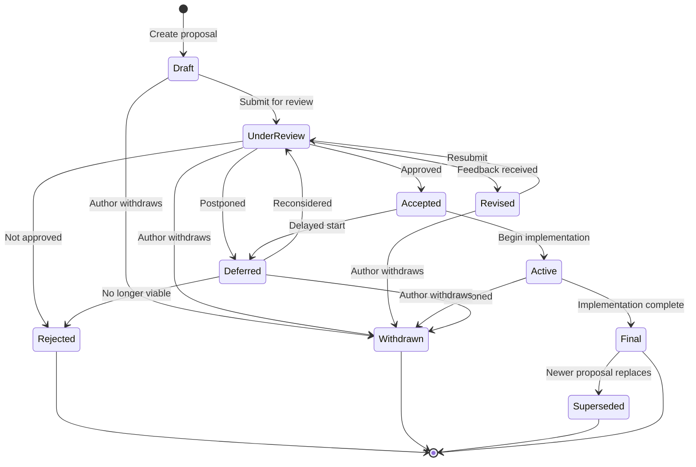

# Zylisp Design Repository Setup Instructions

## Overview
This document contains detailed instructions for reorganizing the `zylisp/design` repository to follow a structured design document workflow with proper states and metadata.

## Tasks to Complete

### 1. Create Repository README.md

Create a new `README.md` file in the root of the repository with the following structure:

```markdown
# Zylisp Design Documents

Design proposals and specifications for the Zylisp programming language.

This repository contains all design documents, proposals, and specifications for Zylisp. Each document follows a structured lifecycle from initial draft through review, acceptance, implementation, and finalization. This process ensures that language design decisions are well-documented, reviewed by the community, and tracked throughout their lifecycle.

## Design Document States

Design documents progress through a series of states that track their evolution from initial proposal to final implementation or closure. Understanding these states helps contributors know where each proposal stands and what actions are needed next.

### State Definitions

- **Draft** - Initial proposal being written and refined by the author
- **Under Review** - Submitted for community/team feedback and discussion
- **Revised** - Incorporating feedback from review; may cycle back to review
- **Accepted** - Approved for implementation
- **Active** - Currently being implemented
- **Final** - Implementation complete and deployed
- **Deferred** - Put on hold for later consideration
- **Rejected** - Decided not to proceed with the proposal
- **Withdrawn** - Author has withdrawn the proposal
- **Superseded** - Replaced by a newer proposal

### State Transitions

Documents typically flow through these states as follows:

- **Draft** → Under Review (when ready for feedback)
- **Under Review** → Revised (feedback received) | Accepted (approved) | Rejected | Deferred | Withdrawn
- **Revised** → Under Review (resubmitted after changes)
- **Accepted** → Active (implementation begins) | Deferred
- **Active** → Final (implementation complete) | Withdrawn
- **Deferred** → Under Review (reconsidered) | Rejected | Withdrawn
- **Final** → Superseded (replaced by newer proposal)



## Directory Structure

```
design-docs/
├── README.md                      # This file
├── 00-index.md                    # Master index/catalog of all design docs
├── 01-draft/                      # Proposals being written
├── 02-under-review/               # Submitted for feedback
├── 03-revised/                    # Being updated based on feedback
├── 04-accepted/                   # Approved, awaiting implementation
├── 05-active/                     # Currently being implemented
├── 06-final/                      # Implemented and complete
├── 07-deferred/                   # On hold for later
├── 08-rejected/                   # Not proceeding
├── 09-withdrawn/                  # Author withdrew
├── 10-superseded/                 # Replaced by newer proposals
└── templates/
    └── design-doc-template.md     # Template for new docs
```

## Document Naming Convention

Documents follow the pattern: `NNNN-short-title.md`

Examples:
- `0001-go-lisp-intent.md`
- `0015-zast-phase3-impl.md`
- `0023-zast-position-removal.md`

## Document Metadata

Each design document includes a YAML frontmatter header with the following fields:

```yaml
---
number: 0001
title: Full Title of the Proposal
author: Author Name(s)
created: YYYY-MM-DD
updated: YYYY-MM-DD
state: Draft
supersedes: None
superseded-by: None
---
```

### Metadata Field Descriptions

- **number**: Four-digit document number (padded with leading zeros)
- **title**: Full descriptive title of the proposal
- **author**: Name(s) of the document author(s)
- **created**: Date the document was first created
- **updated**: Date of the most recent modification
- **state**: Current state in the workflow (see States above)
- **supersedes**: Document number(s) this proposal replaces, or "None"
- **superseded-by**: Document number that replaces this one, or "None"

## Contributing

When creating a new design document:

1. Use the template in `templates/design-doc-template.md`
2. Assign the next available document number
3. Place the document in `01-draft/`
4. Update `00-index.md` with the new entry
5. As the document progresses, move it to the appropriate state directory
6. Update the `state` field in the metadata header when moving between states
```

### 2. Create Directory Structure

Create the following directories:
- `00-index.md` (file, not directory)
- `01-draft/`
- `02-under-review/`
- `03-revised/`
- `04-accepted/`
- `05-active/`
- `06-final/`
- `07-deferred/`
- `08-rejected/`
- `09-withdrawn/`
- `10-superseded/`
- `templates/`

### 3. Process Each Document in archives/

For each file in the `archives/` directory, perform the following steps:

#### 3.1 Extract Git Metadata

Use git commands to extract:
- **Author**: `git log --format='%an' --reverse <filename> | head -1`
- **Created date**: `git log --format='%ai' --reverse <filename> | head -1` (take just the date portion YYYY-MM-DD)
- **Updated date**: `git log --format='%ai' -1 <filename>` (take just the date portion YYYY-MM-DD)

If git history is not available for a file, use:
- Author: "Unknown"
- Created: Current date
- Updated: Current date

#### 3.2 Extract Document Information

From the filename (e.g., `001-go-lisp-intent.md`):
- Extract the number: `001`
- Pad to 4 digits: `0001`
- Extract the slug: `go-lisp-intent`

From the document content:
- Read the first few lines to find a title
- Look for a markdown heading (# Title) or infer from content
- If no clear title exists, convert the slug to title case (e.g., "Go Lisp Intent")

#### 3.3 Create Metadata Header

Prepend the following YAML frontmatter to each document:

```yaml
---
number: NNNN
title: Extracted or Inferred Title
author: Extracted Author Name
created: YYYY-MM-DD
updated: YYYY-MM-DD
state: Draft
supersedes: None
superseded-by: None
---

```

**Important**: Add a blank line after the closing `---` before the original document content begins.

#### 3.4 Rename and Move Document

- Rename from `NNN-title.md` to `NNNN-title.md` (4-digit padding)
- Move to `01-draft/` directory
- Example: `archives/001-go-lisp-intent.md` → `01-draft/0001-go-lisp-intent.md`

### 4. Create Index File

Create `00-index.md` with a table listing all documents:

```markdown
# Zylisp Design Documents Index

## All Documents by Number

| Number | Title | State | Updated |
|--------|-------|-------|---------|
| 0001 | Go Lisp Intent | Draft | YYYY-MM-DD |
| 0002 | Zylisp Projects Plans | Draft | YYYY-MM-DD |
| ... | ... | ... | ... |

## Documents by State

### Draft (01-draft/)
- [0001 - Go Lisp Intent](01-draft/0001-go-lisp-intent.md)
- [0002 - Zylisp Projects Plans](01-draft/0002-zylisp-projects-plans.md)
- ...
```

Sort by document number in ascending order.

### 5. Create Template

Create `templates/design-doc-template.md`:

```markdown
---
number: NNNN
title: Short Descriptive Title
author: Your Name
created: YYYY-MM-DD
updated: YYYY-MM-DD
state: Draft
supersedes: None
superseded-by: None
---

# Title of Proposal

## Abstract

Brief summary of what this proposal addresses.

## Motivation

Why is this needed? What problem does it solve?

## Proposal

Detailed description of the proposed changes.

## Rationale

Why this approach? What alternatives were considered?

## Implementation

How will this be implemented? What are the steps?

## References

- Related documents
- External references
```

### 6. Remove archives/ Directory

After all documents have been processed and moved to `01-draft/`, remove the now-empty `archives/` directory.

## Execution Order

1. Create README.md
2. Create directory structure
3. Create template file
4. Process each document (extract metadata, add header, rename, move)
5. Create 00-index.md
6. Remove archives/ directory

## Validation

After completion, verify:
- All 27 documents are in `01-draft/` with 4-digit numbers
- Each document has proper YAML frontmatter
- README.md exists and is complete
- 00-index.md lists all documents
- Template exists in templates/
- archives/ directory is removed
- All changes are committed to git

## Notes for Claude Code

- Use git commands to extract author and date information where possible
- Handle missing git history gracefully
- Preserve original document content exactly (only prepend metadata)
- Ensure proper YAML formatting (no tabs, proper spacing)
- Test YAML parsing before moving files
- Create directories before moving files into them
- Use atomic operations where possible (create new file, then delete old)
