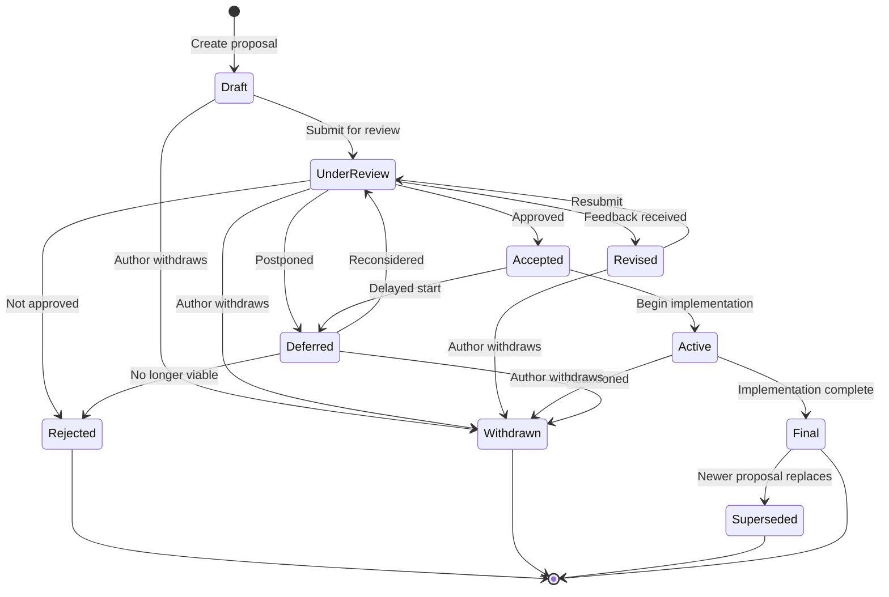

# Zylisp Design Documents

Design proposals and specifications for the Zylisp programming language.

This repository contains all design documents, proposals, and specifications for Zylisp. Each document follows a structured lifecycle from initial draft through review, acceptance, implementation, and finalization. This process ensures that language design decisions are well-documented, reviewed by the community, and tracked throughout their lifecycle.

## Design Document States

Design documents progress through a series of states that track their evolution from initial proposal to final implementation or closure. Understanding these states helps contributors know where each proposal stands and what actions are needed next.

### State Definitions

- **Draft** - Initial proposal being written and refined by the author
- **Under Review** - Submitted for community/team feedback and discussion
- **Revised** - Incorporating feedback from review; may cycle back to review
- **Accepted** - Approved for implementation
- **Active** - Currently being implemented
- **Final** - Implementation complete and deployed
- **Deferred** - Put on hold for later consideration
- **Rejected** - Decided not to proceed with the proposal
- **Withdrawn** - Author has withdrawn the proposal
- **Superseded** - Replaced by a newer proposal

### State Transitions

Documents typically flow through these states as follows:

- **Draft** → Under Review (when ready for feedback)
- **Under Review** → Revised (feedback received) | Accepted (approved) | Rejected | Deferred | Withdrawn
- **Revised** → Under Review (resubmitted after changes)
- **Accepted** → Active (implementation begins) | Deferred
- **Active** → Final (implementation complete) | Withdrawn
- **Deferred** → Under Review (reconsidered) | Rejected | Withdrawn
- **Final** → Superseded (replaced by newer proposal)



## Directory Structure

```
design-docs/
├── README.md                      # This file
├── 00-index.md                    # Master index/catalog of all design docs
├── 01-draft/                      # Proposals being written
├── 02-under-review/               # Submitted for feedback
├── 03-revised/                    # Being updated based on feedback
├── 04-accepted/                   # Approved, awaiting implementation
├── 05-active/                     # Currently being implemented
├── 06-final/                      # Implemented and complete
├── 07-deferred/                   # On hold for later
├── 08-rejected/                   # Not proceeding
├── 09-withdrawn/                  # Author withdrew
├── 10-superseded/                 # Replaced by newer proposals
└── templates/
    └── design-doc-template.md     # Template for new docs
```

## Document Naming Convention

Documents follow the pattern: `NNNN-short-title.md`

Examples:

- `0001-go-lisp-intent.md`
- `0015-zast-phase3-impl.md`
- `0023-zast-position-removal.md`

## Document Metadata

Each design document includes a YAML frontmatter header with the following fields:

```yaml
---
number: 0001
title: Full Title of the Proposal
author: Author Name(s)
created: YYYY-MM-DD
updated: YYYY-MM-DD
state: Draft
supersedes: None
superseded-by: None
---
```

### Metadata Field Descriptions

- **number**: Four-digit document number (padded with leading zeros)
- **title**: Full descriptive title of the proposal
- **author**: Name(s) of the document author(s)
- **created**: Date the document was first created
- **updated**: Date of the most recent modification
- **state**: Current state in the workflow (see States above)
- **supersedes**: Document number(s) this proposal replaces, or "None"
- **superseded-by**: Document number that replaces this one, or "None"

## Managing Document States with zdp

The `zdp` tool (Zylisp Design Proposal) helps manage document state transitions and organization.

### Installation

No installation needed. You can run the tool in two ways:

**Option 1: Using the wrapper script (recommended)**

```bash
./zdp [arguments]
```

**Option 2: Using Go directly**

```bash
go run zdp.go [arguments]
```

The examples below use the wrapper script for brevity.

### Usage

#### Add a document to the repo

To add a new design document with full automated processing:

```bash
./zdp add <path-to-doc.md>
```

Example:

```bash
./zdp add my-new-feature.md
```

This will automatically:

1. **Assign a document number**: If the file doesn't have a numbered prefix (e.g., `0031-`), the tool finds the highest existing number and assigns the next sequential number
2. **Move to project directory**: If the file is outside the design repository, it's moved to the project root
3. **Move to draft state**: If the file isn't in a state directory, it's moved to `01-draft/`
4. **Add YAML frontmatter**: Adds complete metadata headers if missing (number, title, author, dates, state, etc.)
5. **Sync state with directory**: Updates the `state:` field to match the file's actual directory location
6. **Stage in git**: Runs `git add` to stage the file for commit
7. **Update index**: Adds the document to both the "All Documents by Number" table and the appropriate state section in `00-index.md`

**Use cases**:

- Adding a brand new design document to the repository
- Importing an existing document from elsewhere
- Quickly onboarding a document with all necessary metadata and organization

**Note**: This command performs all the setup steps automatically. For documents already in the repository that just need specific updates, use the individual commands (`add-headers`, `index`, etc.) instead.

#### Transition a document to a new state

```bash
./zdp <path-to-doc.md> <new-state>
```

Example:

```bash
./zdp 01-draft/0015-zast-phase3-impl.md "Under Review"
```

This will:

- Update the document's `state:` field to "Under Review"
- Update the `updated:` field to today's date
- Move the document to `02-under-review/`
- Update `00-index.md` to reflect the new state and location

#### Move a document to match its header state

If you've manually updated a document's `state:` field but haven't moved it yet:

```bash
./zdp <path-to-doc.md>
```

Example:

```bash
./zdp 01-draft/0015-zast-phase3-impl.md
```

The tool will read the document's `state:` field and move it to the appropriate directory.

#### Add a document to the index

If you've created a new document or need to ensure a document is properly indexed:

```bash
./zdp index <path-to-doc.md>
```

Example:

```bash
./zdp index 01-draft/0029-new-feature.md
```

This will:

- Add the document to the "All Documents by Number" table if missing
- Add the document to the appropriate state section if missing
- Do nothing if the document is already properly indexed

**Note**: When transitioning documents with the other commands, the index is automatically updated. This command is only needed for manually created documents or to fix index inconsistencies.

#### Add or update document headers

If you have a document without YAML frontmatter or with incomplete metadata:

```bash
./zdp add-headers <path-to-doc.md>
```

Example:

```bash
./zdp add-headers 01-draft/0030-new-feature.md
```

This will:

- Extract metadata from git history:
  - **author**: First committer of the file
  - **created**: Date of first commit
  - **updated**: Date of last commit
- Extract metadata from the file:
  - **number**: From filename (e.g., "0030" from "0030-new-feature.md")
  - **title**: From first `# Heading` in the document, or inferred from filename
- Add default values for:
  - **state**: "Draft"
  - **supersedes**: "None"
  - **superseded-by**: "None"
- Preserve any existing metadata values (existing values take precedence)
- Display which fields were added or updated

**Use cases**:

- Adding headers to documents created before the repository reorganization
- Completing partial YAML frontmatter
- Fixing malformed or missing metadata

**Note**: If the file is not in git history, the tool will use fallback values (author="Unknown", dates=current date).

#### Synchronize the index with git-tracked documents

To ensure `00-index.md` is fully synchronized with all documents tracked in git:

```bash
./zdp update-index
```

This will:

- **Scan git-tracked documents**: Find all `.md` files in state directories tracked by git
- **Update the table**: Add missing documents, update changed dates, remove entries for deleted files
- **Update state sections**: Add missing document links, remove orphaned links
- **Report changes**: Display what was added, updated, or removed

Example output:

```text
Synchronizing index with git-tracked documents...

Table Updates:
  ✓ Added: 0029-zdp-tool-instructions.md
  ✓ Updated date: 0019-zylisp-arch-v1.1.0.md (2025-10-04 → 2025-10-05)

Section Updates (Final):
  ✓ Added: 0029-zdp-tool-instructions.md

Section Updates (Draft):
  ✗ Removed: 9999-test-index-update.md (file not found)

Summary: 4 changes made to index
```

**Use cases**:

- After manually creating or deleting design documents
- After using `git mv` to reorganize files
- To audit and fix index inconsistencies
- As part of repository maintenance

**Note**: This command is idempotent - running it multiple times is safe and will show "Index is already up to date!" if no changes are needed.

#### List all documents by state

```bash
./zdp
```

This displays all documents organized by their current state.

#### List supported states

```bash
./zdp states
```

This shows all valid state names that can be used.

### Supported States

- Draft
- Under Review
- Revised
- Accepted
- Active
- Final
- Deferred
- Rejected
- Withdrawn
- Superseded

State names are case-insensitive when used on the command line.

## Contributing

When creating a new design document:

1. Use the template in `templates/design-doc.md`
2. Assign the next available document number
3. Place the document in `01-draft/`
4. Add the document to the index: `./zdp index 01-draft/NNNN-your-doc.md`
5. As the document progresses, use `zdp` to transition it: `./zdp 01-draft/NNNN-your-doc.md "Under Review"`
