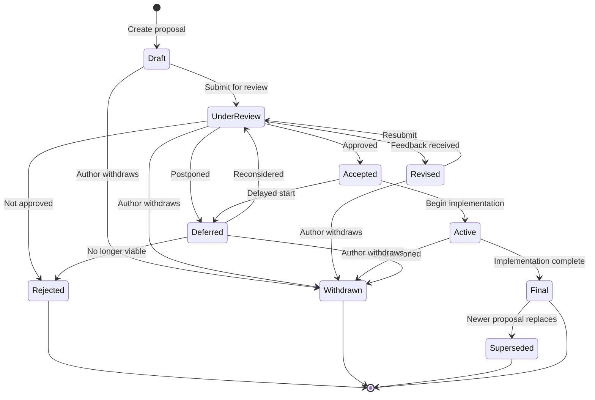

# Zylisp Design Documents

Design proposals and specifications for the Zylisp programming language.

This repository contains all design documents, proposals, and specifications for Zylisp. Each document follows a structured lifecycle from initial draft through review, acceptance, implementation, and finalization. This process ensures that language design decisions are well-documented, reviewed by the community, and tracked throughout their lifecycle.

## Design Document States

Design documents progress through a series of states that track their evolution from initial proposal to final implementation or closure. Understanding these states helps contributors know where each proposal stands and what actions are needed next.

### State Definitions

- **Draft** - Initial proposal being written and refined by the author
- **Under Review** - Submitted for community/team feedback and discussion
- **Revised** - Incorporating feedback from review; may cycle back to review
- **Accepted** - Approved for implementation
- **Active** - Currently being implemented
- **Final** - Implementation complete and deployed
- **Deferred** - Put on hold for later consideration
- **Rejected** - Decided not to proceed with the proposal
- **Withdrawn** - Author has withdrawn the proposal
- **Superseded** - Replaced by a newer proposal

### State Transitions

Documents typically flow through these states as follows:

- **Draft** → Under Review (when ready for feedback)
- **Under Review** → Revised (feedback received) | Accepted (approved) | Rejected | Deferred | Withdrawn
- **Revised** → Under Review (resubmitted after changes)
- **Accepted** → Active (implementation begins) | Deferred
- **Active** → Final (implementation complete) | Withdrawn
- **Deferred** → Under Review (reconsidered) | Rejected | Withdrawn
- **Final** → Superseded (replaced by newer proposal)



## Directory Structure

```
design-docs/
├── README.md                      # This file
├── 00-index.md                    # Master index/catalog of all design docs
├── 01-draft/                      # Proposals being written
├── 02-under-review/               # Submitted for feedback
├── 03-revised/                    # Being updated based on feedback
├── 04-accepted/                   # Approved, awaiting implementation
├── 05-active/                     # Currently being implemented
├── 06-final/                      # Implemented and complete
├── 07-deferred/                   # On hold for later
├── 08-rejected/                   # Not proceeding
├── 09-withdrawn/                  # Author withdrew
├── 10-superseded/                 # Replaced by newer proposals
└── templates/
    └── design-doc-template.md     # Template for new docs
```

## Document Naming Convention

Documents follow the pattern: `NNNN-short-title.md`

Examples:
- `0001-go-lisp-intent.md`
- `0015-zast-phase3-impl.md`
- `0023-zast-position-removal.md`

## Document Metadata

Each design document includes a YAML frontmatter header with the following fields:

```yaml
---
number: 0001
title: Full Title of the Proposal
author: Author Name(s)
created: YYYY-MM-DD
updated: YYYY-MM-DD
state: Draft
supersedes: None
superseded-by: None
---
```

### Metadata Field Descriptions

- **number**: Four-digit document number (padded with leading zeros)
- **title**: Full descriptive title of the proposal
- **author**: Name(s) of the document author(s)
- **created**: Date the document was first created
- **updated**: Date of the most recent modification
- **state**: Current state in the workflow (see States above)
- **supersedes**: Document number(s) this proposal replaces, or "None"
- **superseded-by**: Document number that replaces this one, or "None"

## Contributing

When creating a new design document:

1. Use the template in `templates/design-doc-template.md`
2. Assign the next available document number
3. Place the document in `01-draft/`
4. Update `00-index.md` with the new entry
5. As the document progresses, move it to the appropriate state directory
6. Update the `state` field in the metadata header when moving between states
