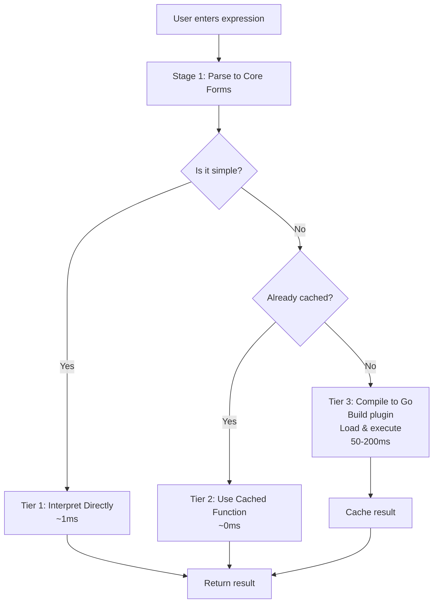
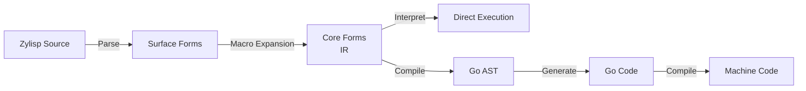
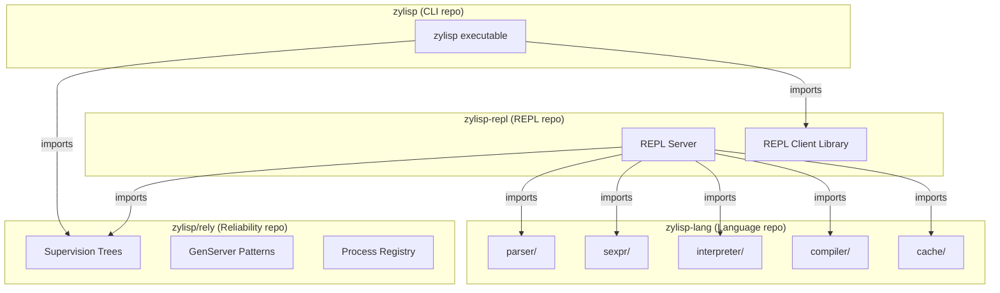
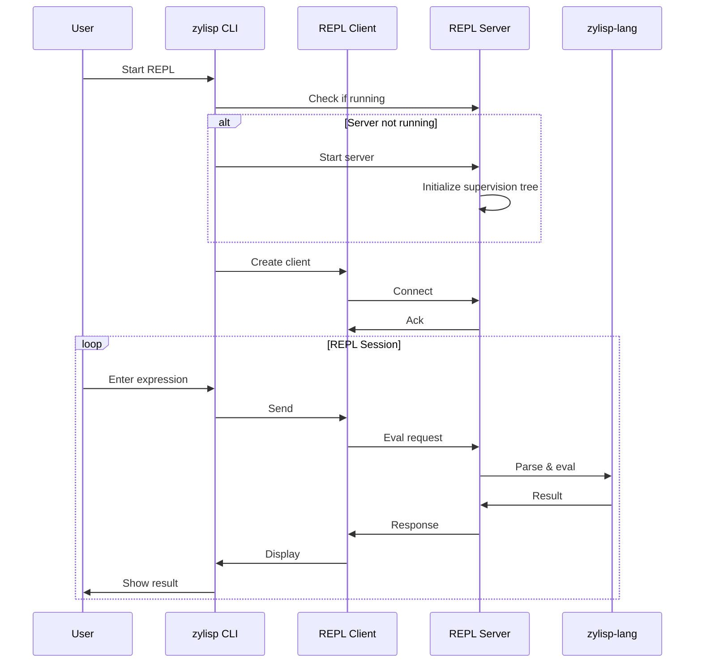
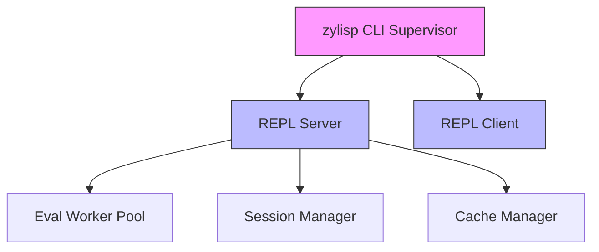
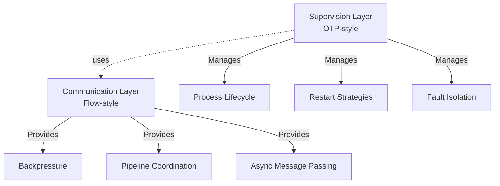

# Zylisp REPL Architecture & Design Decisions

## Executive Summary

This document outlines the architecture for Zylisp's REPL system, compilation strategy, and reliability infrastructure. Key decisions include:

- **Two-stage compilation**: Zylisp source → Core forms (IR) → Go AST → Go code
- **Tiered execution**: Fast interpreter for simple expressions, cached compilation for complex ones
- **nREPL-style architecture**: Client/server model with supervision trees
- **Reliability-first**: Built on OTP-style supervision patterns from day one
- **Clean separation**: Multiple repos with no circular dependencies

---

## 1. The Core Challenge: REPL Performance for a Compiled Language

### Problem Statement

Zylisp compiles to Go, which means each expression evaluation requires:

1. Parsing Zylisp syntax
2. Generating Go code
3. Invoking the Go compiler
4. Executing the result

This creates user-perceivable lag (50-200ms) that makes for a poor REPL experience.

### How Others Have Solved This

#### Existing Go REPL Projects

**Gore (Go REPL)**

- Shells out to Go compiler for each expression
- Wraps code in `main()`, compiles to temp binary, executes
- **Verdict**: Slow but correct

**Yaegi**

- Pure Go interpreter, no compilation
- Parses Go code into AST and interprets directly
- ~milliseconds for REPL use
- **Verdict**: Fast but doesn't give compiled performance

**Various go-eval projects**

- Hybrid approaches with batched compilation
- **Verdict**: Improved but still perceivable delays

#### JIT/Incremental Compilation (Julia, Swift)

- Use LLVM's JIT compilation
- Parse → Generate LLVM IR → JIT compile to machine code
- Takes ~10-50ms per expression
- Aggressive caching of compiled functions
- **Verdict**: Acceptable latency with good caching

---

## 2. Zylisp's Solution: Tiered Execution Strategy

### Overview

We use a three-tier approach that optimizes common cases while maintaining full compilation capability:



### Tier 1: Direct Evaluation (<1ms)

**For canonical s-expressions that are "obviously simple":**

- Numbers, strings, booleans
- Simple arithmetic on literals: `(+ 1 2)`
- Variable lookups from REPL environment
- List/vector construction of literals

A tiny interpreter pattern-matches these forms and evaluates directly without compilation.

### Tier 2: Cached Compilation (~0ms after first use)

When a function is defined:

```zylisp
(defn add [x y] (+ x y))
```

1. Generate Go code
2. Compile it once
3. Store compiled function in memory (via Go plugins)
4. Subsequent calls are instant function invocations

### Tier 3: JIT Compilation (50-200ms)

For complex expressions requiring compilation:

```zylisp
(map (fn [x] (* x x)) [1 2 3 4])
```

- Compile in background
- Show spinner if >50ms
- Cache the result for future use

### Key Optimizations

#### 1. Incremental Compilation

- Maintain a single Go file with accumulated definitions
- Append new code rather than restarting compiler
- Use `go build -buildmode=plugin` to compile
- Amortizes compiler startup cost

#### 2. Fast Path Detection

```go
func canInterpret(expr SExpr) bool {
    switch e := expr.(type) {
    case Literal:
        return true
    case List:
        if len(e) == 0 { return true }
        op := e[0]
        // Simple arithmetic operators with literal args?
        if isSimpleOp(op) && allLiterals(e[1:]) {
            return true
        }
    }
    return false
}
```

#### 3. Compilation Batching

- Queue expressions during typing bursts
- Compile them together in one Go compilation unit
- Show results as they complete

#### 4. Precompiled Standard Library

- Compile all Zylisp stdlib functions ahead of time
- Load as Go plugin at REPL startup
- All stdlib calls become instant

---

## 3. Terminology & Conceptual Model

### Compilation Pipeline



### Definitions

| Term | Definition | Example |
|------|------------|---------|
| **Zylisp source** / **surface syntax** | What users write in `.zl` files | `(defn add [x y] (+ x y))` |
| **Surface forms** | Parsed S-expressions with macros/sugar | After reader, before expansion |
| **Core forms** / **IR** | Canonical, normalized S-expressions | After macro expansion & desugaring |
| **Go AST** | Go's `ast` package structures | Target of the compiler |
| **Go source** | Generated Go code text | Final output before Go compilation |

**IR** = "Intermediate Representation" (standard compiler terminology)

- The form between source language and target language
- Examples: LLVM IR, JVM bytecode, Core forms

### Why "Core Forms" vs "IR"

- **Documentation**: Use "Core forms" (more accessible)
- **Technical discussions**: "IR" or "Zylisp IR" (standard terminology)
- **Code/comments**: Either, but be consistent

---

## 4. Repository Architecture

### Design Principles

1. **No circular dependencies**
2. **Clear separation of concerns**
3. **Reusable components**
4. **Supervision from day one**

### Repository Structure



### Repository Details

#### `zylisp/cli`

**Purpose**: Developer-facing executable

**Responsibilities**:

- Manages REPL server lifecycle
- Creates and manages REPL client
- Handles terminal I/O
- Provides other CLI tools (compile, format, etc.)

**Key**: No circular dependencies! Imports `zylisp-repl/client` but not vice versa.

#### `zylisp/repl` (REPL Server/Client)

**Purpose**: nREPL-style client/server model

**Contains**:

- REPL server implementation
- REPL client library
- nREPL protocol implementation

**Characteristics**:

- Multiple clients can connect to one server
- Server runs in supervision tree
- Session management
- Request queuing

#### `zylisp/lang` (Language Implementation)

**Package structure**:

```
zylisp-lang/
├── parser/          # Zylisp syntax → S-expressions
│   ├── lexer.go     # Tokenization
│   ├── reader.go    # Surface forms from tokens
│   └── expander.go  # Surface → Core forms (macro expansion)
│
├── sexpr/           # Canonical S-expression types
│   ├── types.go     # SExpr interface, List, Symbol, etc.
│   ├── print.go     # Pretty printing
│   └── equals.go    # Structural equality
│
├── interpreter/     # Execute Core forms directly
│   └── eval.go      # Core forms → values
│
├── compiler/        # Core forms → Go code
│   ├── analyze.go   # Core forms → Go AST
│   └── emit.go      # Go AST → Go source text
│
└── cache/           # Compilation caching
    ├── cache.go     # Compiled function storage/retrieval
    ├── plugin.go    # Go plugin loading
    └── builder.go   # Orchestrate: compile → cache → load
```

**Design Decision: Cache Package**

**Options considered**:

- `cache` - Simple, clear
- `compcache` - More specific
- `compiled` / `artifacts` - Emphasizes what's stored
- `codegen` - Broader, includes generation + caching

**Decision**: `cache`

- Clear purpose
- Could include other caching later (macro expansion, etc.)
- Simple import: `import "github.com/.../zylisp-lang/cache"`

#### `zylisp/rely` (Reliability Infrastructure)

**Purpose**: OTP-style supervision and fault tolerance

**Note**: This is a foundational library for Zylisp's reliability-first design. Full planning deferred to separate discussion.

**Core components** (planned):

- Supervision trees
- GenServer behavior pattern
- Process registry
- Restart strategies
- Event system

Will build on top of the excellent library:

- <https://github.com/thejerf/suture>

---

## 5. REPL Server Architecture

### nREPL-Inspired Design

Following the nREPL model from the Clojure ecosystem:

- General-purpose REPL server
- Multiple clients can connect
- Server handles evaluation, session management
- Client handles I/O, connection management

### Connection Model



### Server Evaluation Flow

```go
// Simplified server eval logic
func (s *Server) Eval(source string) (Value, error) {
    // Parse source to surface forms
    surface, err := parser.Parse(source)
    if err != nil {
        return nil, err
    }

    // Expand to core forms (IR)
    core, err := parser.Expand(surface)
    if err != nil {
        return nil, err
    }

    // Try fast path (Tier 1)
    if interpreter.IsSimple(core) {
        return interpreter.Eval(core, s.env)
    }

    // Check cache (Tier 2)
    if fn := cache.Lookup(core); fn != nil {
        return fn(s.env), nil
    }

    // Compile, cache, execute (Tier 3)
    goAST := compiler.Compile(core)
    fn, err := cache.BuildAndLoad(goAST)
    if err != nil {
        return nil, err
    }

    return fn(s.env), nil
}
```

---

## 6. Supervision & Reliability

### Core Philosophy

**Like Erlang/LFE**: Zylisp will have reliability built into the language core, not as an optional library.

### Supervision Tree Example



### Integration with rely/Suture

```go
// In zylisp CLI
func main() {
    sup := rely.NewSupervisor(rely.OneForOne)

    // Add REPL server as supervised child
    sup.AddChild(rely.ChildSpec{
        ID:      "repl-server",
        Start:   startREPLServer,
        Restart: rely.Permanent, // Always restart
    })

    // Add REPL client as supervised child
    sup.AddChild(rely.ChildSpec{
        ID:      "repl-client",
        Start:   startREPLClient,
        Restart: rely.Permanent,
    })

    // Start supervision tree
    if err := sup.Start(context.Background()); err != nil {
        log.Fatal(err)
    }
}
```

### rely Library Scope

**Decision**: Start with Suture and use it to fully build out `rely`, using `rely` from day one

**Rationale**:

- Suture provides battle-tested supervision
- Missing OTP features are needed day one

**What Suture provides**:

- OneForOne supervision
- Automatic restart with exponential backoff
- Max restart intensity (prevent restart loops)
- Graceful shutdown coordination

**What we'll add**:

- GenServer behavior pattern
- Process registry (named processes)
- Synchronous call/reply pattern
- Event subscription system
- Multiple restart strategies (OneForAll, RestForOne, SimpleOneForOne)
- Full OTP-style behaviors
- Advanced shutdown strategies

---

## 7. Design Decisions Summary

### Core Compilation Strategy

| Decision | Rationale |
|----------|-----------|
| Two-stage compilation | Clean separation: syntax → IR → target |
| Three-tier execution | Optimize common cases, maintain full power |
| Canonical s-expressions as IR | Perfect for interpretation and compilation |
| Go plugins for caching | Native Go mechanism, good performance |

### Terminology

| Decision | Rationale |
|----------|-----------|
| "Core forms" for IR | More accessible than "IR" in docs |
| "Surface syntax" for input | Clear distinction from Core forms |
| Reserve "AST" for Go's AST | Avoid confusion |
| "Zylisp source" for files | Standard terminology |

### Repository Structure

| Decision | Rationale |
|----------|-----------|
| Separate `zylisp-repl` repo | Avoid circular dependencies |
| CLI in own repo | Clean import citizen |
| `cache` package in lang repo | Generally useful, not REPL-specific |
| `rely` as separate library | Reusable beyond Zylisp |

### REPL Architecture

| Decision | Rationale |
|----------|-----------|
| nREPL-style client/server | Multiple clients, session management |
| Server in supervision tree | Reliability from day one |
| Server manages evaluation tiers | Centralized optimization logic |

### Reliability Strategy

| Decision | Rationale |
|----------|-----------|
| Build full `rely` day one | Use battle-tested Suture as foundation |
| Supervision from day one | Core to Zylisp's philosophy |
| Language-level support | Like Erlang/LFE, not bolted-on |

---

## 8. Flow Library Discussion

### Question Explored

Could Clojure's `core.async.flow` be a good foundation for implementing OTP-style supervision?

### Answer: No (Conceptual Mismatch)

**`core.async.flow` is about**:

- Coordinating async operations with backpressure
- Building dataflow pipelines
- Managing concurrent computations
- Similar to: Apache Beam, Go channels + context

**Erlang/OTP is about**:

- Process lifecycle management
- Fault isolation and supervision hierarchies
- "Let it crash" philosophy
- Automated recovery

**Verdict**: Different problem domains. Flow might be useful for communication *between* supervised processes, but not for supervision itself.

### Where Flow Concepts Might Help



**Conclusion**: Build supervision first, add flow-style patterns only if needed for specific communication patterns.

---

## 9. Implementation Roadmap

### Phase 1: Core Infrastructure (Weeks 1-2)

1. **Set up repositories**
   - `zylisp-lang` with basic packages
   - `zylisp-repl` with server/client skeletons
   - `zylisp` CLI tool

2. **Implement Stage 1 compiler**
   - Lexer and parser
   - Surface forms → Core forms
   - Basic macro expansion

3. **Implement Stage 2 compiler**
   - Core forms → Go AST
   - Go AST → Go source
   - Basic compilation (no optimization yet)

4. **Get basic REPL working**
   - Server accepts connections
   - Client sends expressions
   - Everything goes through compiler (slow but correct)

### Phase 2: Optimization (Weeks 3-4)

5. **Add Tier 1 interpreter**
   - Identify simple expressions
   - Direct evaluation for literals and basic ops

6. **Add Tier 2 caching**
   - Compile to Go plugins
   - Cache compiled functions
   - Load and execute cached code

7. **Profile and optimize**
   - Measure tier performance
   - Optimize hot paths
   - Tune cache strategies

### Phase 3: Reliability (Weeks 5-6)

8. **Integrate Suture**
   - Wrap REPL server in supervisor
   - Add restart policies
   - Test failure scenarios

9. **Build rely helpers**
   - GenServer pattern
   - Process registry
   - Call/reply helpers

10. **Polish REPL UX**
    - Progress indicators for slow compilation
    - Error handling and recovery
    - Session management

### Phase 4: Future Enhancements

- Multiple client support
- Remote REPL connections
- Advanced caching strategies
- Full `rely` library (if needed)
- Language-level supervision syntax

---

## 10. Open Questions & Future Work

### Deferred to Separate Planning

1. **Language-level reliability syntax**
   - How to define supervised processes in Zylisp?
   - Syntax for supervision trees?
   - Message passing primitives?

2. **Full `rely` library design**
   - Event system design
   - Process linking/monitoring

3. **Advanced compilation strategies**
   - Whole-program optimization
   - Cross-module inlining
   - Profile-guided optimization

### Questions for Near-Term Resolution

1. **nREPL protocol specifics**
   - Which nREPL protocol version?
   - Custom extensions needed?

2. **Plugin loading mechanics**
   - Security considerations?
   - Plugin versioning/compatibility?
   - Memory management for long-running REPL?

3. **Session isolation**
   - Separate namespaces per client?
   - Shared vs. isolated state?

---

## Conclusion

This architecture provides:

- ✅ Fast REPL experience through tiered execution
- ✅ Clean separation of concerns across repositories
- ✅ No circular dependencies
- ✅ Supervision and reliability from day one
- ✅ Clear path from prototype to production
- ✅ Foundation for language-level reliability features

The design balances pragmatism (start with Suture) with vision (language-level reliability like Erlang), allowing incremental development while maintaining architectural clarity.
