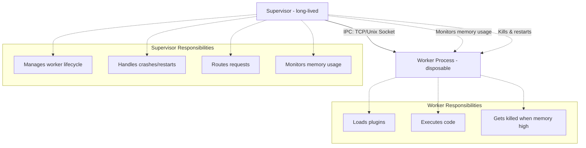

# REPL Architecture Addendum: Memory Management & Process Supervision

## Problem Statement

The incremental compilation strategy using Go plugins (`-buildmode=plugin`) creates a critical memory management challenge: **plugins cannot be unloaded once loaded into a process**. This leads to memory leaks as the REPL executes multiple iterations.

## What are Go Plugins?

Go plugins are **dynamically loadable shared libraries** containing compiled Go code:

- Compiled with `go build -buildmode=plugin` to produce `.so` files (Linux/macOS) or `.dll` (Windows)
- Loaded at runtime into a running Go program using the `plugin` package
- Allow access to exported symbols (variables and functions)

### Example Usage

```go
// Compile user code as plugin
// go build -buildmode=plugin -o user_code.so user_code.go

// Load in REPL
plug, err := plugin.Open("user_code.so")
symResult, _ := plug.Lookup("Result")
result := symResult.(*int)
```

### Plugin Limitations

- **Cannot be unloaded** - memory leak on every load
- Linux/macOS only (Windows support experimental)
- Must be compiled with exact same Go version as loading program
- All dependencies must match exactly

## Solution: Supervised Worker Architecture

Apply the Erlang supervision tree pattern to manage the memory leak problem through process isolation and lifecycle management.

### Architecture Overview



### Why Process Isolation (Not Goroutines)?

**Option 1: Separate Process** ✅ Recommended
- True memory isolation
- Can forcibly kill worker (no graceful shutdown needed)
- Worker crashes don't affect supervisor
- Easy to monitor memory usage externally
- **Actually solves the memory leak**

**Option 2: Goroutines + Channels** ❌ Not Viable
- Goroutines share process address space
- Loaded plugins still leak in the same process
- Cannot forcibly kill a goroutine
- Does not solve the core problem

### Communication Protocol

Use TCP or Unix domain sockets for IPC between supervisor and worker:

```go
type Request struct {
    Code string
    ID   int
}

type Response struct {
    Result string
    Error  string
}
```

## Memory Monitoring Strategies

The supervisor must decide when to restart the worker based on memory usage.

### Restart Triggers

1. **After N requests** - Simple, predictable
2. **When memory exceeds threshold** - Optimal, requires instrumentation
3. **On worker crash** - Handle errors gracefully

### Memory Instrumentation Options

#### Option 1: `runtime.MemStats` (In-Process)

Worker self-reports memory usage:

```go
import "runtime"

var m runtime.MemStats
runtime.ReadMemStats(&m)

// Key fields:
// - m.Alloc: Currently allocated heap memory
// - m.TotalAlloc: Cumulative bytes allocated
// - m.Sys: Total memory from OS
// - m.HeapInuse: Bytes in in-use spans
```

**Pros:**
- Built-in, no dependencies
- Accurate Go-specific metrics

**Cons:**
- Worker must cooperate
- Doesn't catch non-Go memory (C libraries, mmap)

#### Option 2: External Process Monitoring (Linux)

Supervisor monitors via `/proc/[pid]/status`:

```go
func getProcessMemoryMB(pid int) (uint64, error) {
    f, err := os.Open(fmt.Sprintf("/proc/%d/status", pid))
    // Parse VmRSS (Resident Set Size - actual physical RAM)
}
```

**Pros:**
- Supervisor has full control
- Catches all memory, not just Go heap
- Worker cannot lie or fail to report

**Cons:**
- Linux-only

#### Option 3: `gopsutil` Library ✅ Recommended

Cross-platform monitoring using `github.com/shirou/gopsutil/v3`:

```go
import "github.com/shirou/gopsutil/v3/process"

func getProcessMemoryMB(pid int) (uint64, error) {
    proc, err := process.NewProcess(int32(pid))
    if err != nil {
        return 0, err
    }
    
    memInfo, err := proc.MemoryInfo()
    if err != nil {
        return 0, err
    }
    
    return memInfo.RSS / 1024 / 1024, nil
}
```

**Pros:**
- Works on macOS, Linux, Windows
- Clean API, well-maintained
- Uses native syscalls (sysctl on macOS, /proc on Linux)

**Cons:**
- External dependency (minimal)

#### Comparison Table

| Approach | macOS | Linux | Windows | Complexity | External Deps |
|----------|-------|-------|---------|------------|---------------|
| `runtime.MemStats` | ✅ | ✅ | ✅ | Low | No |
| `/proc` parsing | ❌ | ✅ | ❌ | Low | No |
| `gopsutil` | ✅ | ✅ | ✅ | Low | Yes (small) |
| Native syscalls | ✅ | ✅ | ✅ | High | No |

### Recommended: Hybrid Approach

Combine worker self-reporting with external monitoring:

```go
type WorkerMonitor struct {
    lastReport    HealthReport  // From worker
    externalMemMB uint64        // From gopsutil
}

func (m *WorkerMonitor) ShouldRestart() bool {
    reported := m.lastReport.GoHeapMB
    external := m.externalMemMB
    threshold := 500 // MB
    
    return reported > threshold || external > threshold
}
```

## Implementation Sketch

```go
type Supervisor struct {
    worker          *Worker
    memThresholdMB  uint64
    maxRequests     int
    requestCount    int
}

type Worker struct {
    cmd     *exec.Cmd
    pid     int32
    conn    net.Conn
}

func (s *Supervisor) Execute(code string) (string, error) {
    if s.shouldRestart() {
        s.restartWorker()
    }
    
    result, err := s.worker.SendRequest(code)
    s.requestCount++
    return result, err
}

func (s *Supervisor) shouldRestart() bool {
    // Check request count
    if s.requestCount >= s.maxRequests {
        return true
    }
    
    // Check memory using gopsutil
    proc, err := process.NewProcess(s.worker.pid)
    if err != nil {
        return true // Worker might be dead
    }
    
    memInfo, err := proc.MemoryInfo()
    if err != nil {
        return true
    }
    
    memMB := memInfo.RSS / 1024 / 1024
    return memMB > s.memThresholdMB
}

func (s *Supervisor) restartWorker() {
    if s.worker != nil {
        s.worker.Kill()
    }
    
    s.worker = s.spawnWorker()
    s.requestCount = 0
}
```

## Key Design Decisions

1. **Use separate process, not goroutines** - Only way to actually reclaim plugin memory
2. **Supervisor monitors externally** - Don't trust worker to report accurately
3. **Use `gopsutil` for monitoring** - Cross-platform, works on macOS (dev) and Linux (prod)
4. **TCP/Unix socket for IPC** - Clean process boundary, easy to kill worker
5. **Restart on memory threshold or request count** - Belt and suspenders approach

## Benefits

- ✅ Solves plugin memory leak problem
- ✅ Worker crashes don't affect supervisor
- ✅ Predictable memory usage
- ✅ Works on macOS during development
- ✅ Works on Linux in production
- ✅ Clean separation of concerns
- ✅ Testable components

## Trade-offs

- Slightly higher latency due to IPC overhead
- Additional complexity of process management
- Worker restart briefly interrupts service (acceptable for REPL use case)
