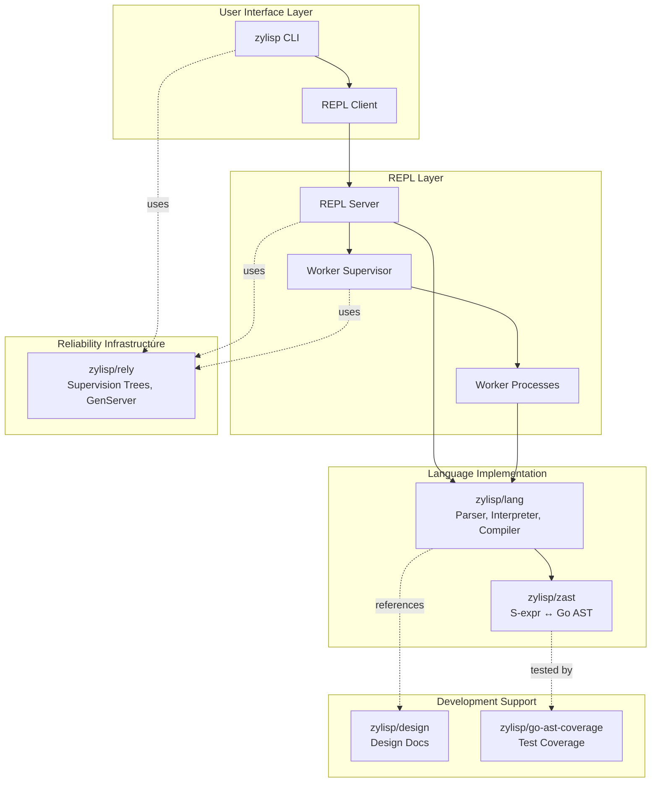
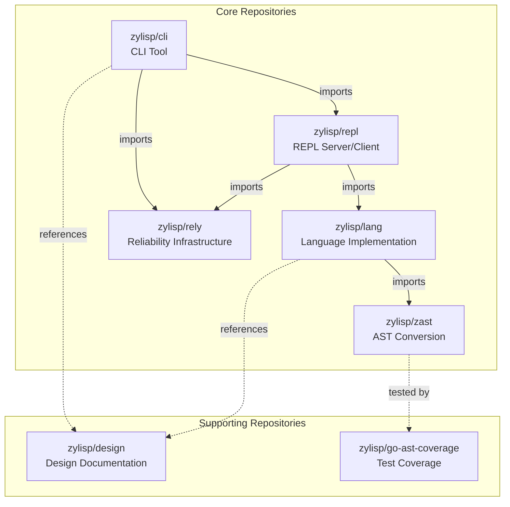
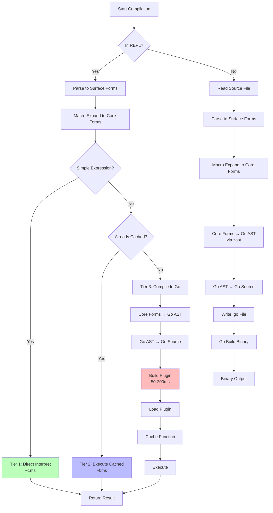
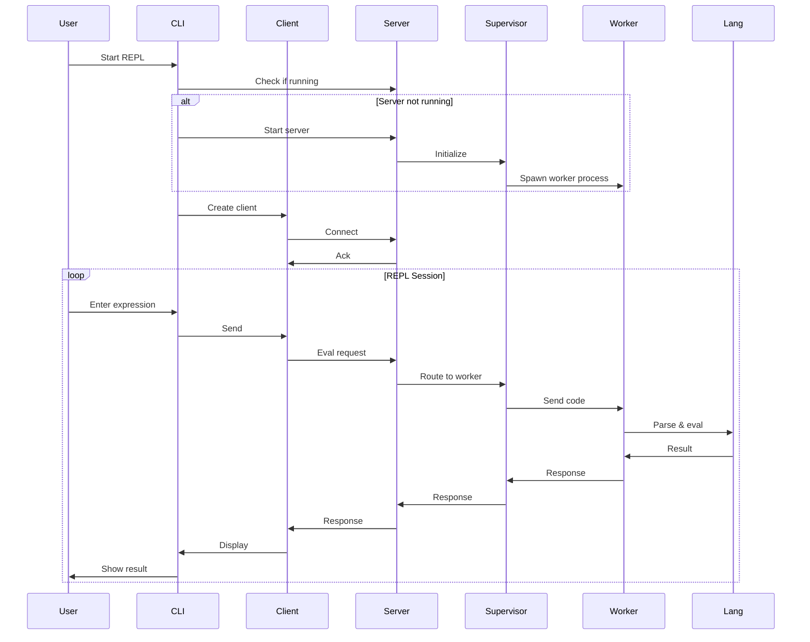
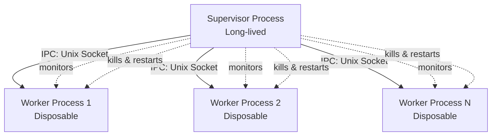
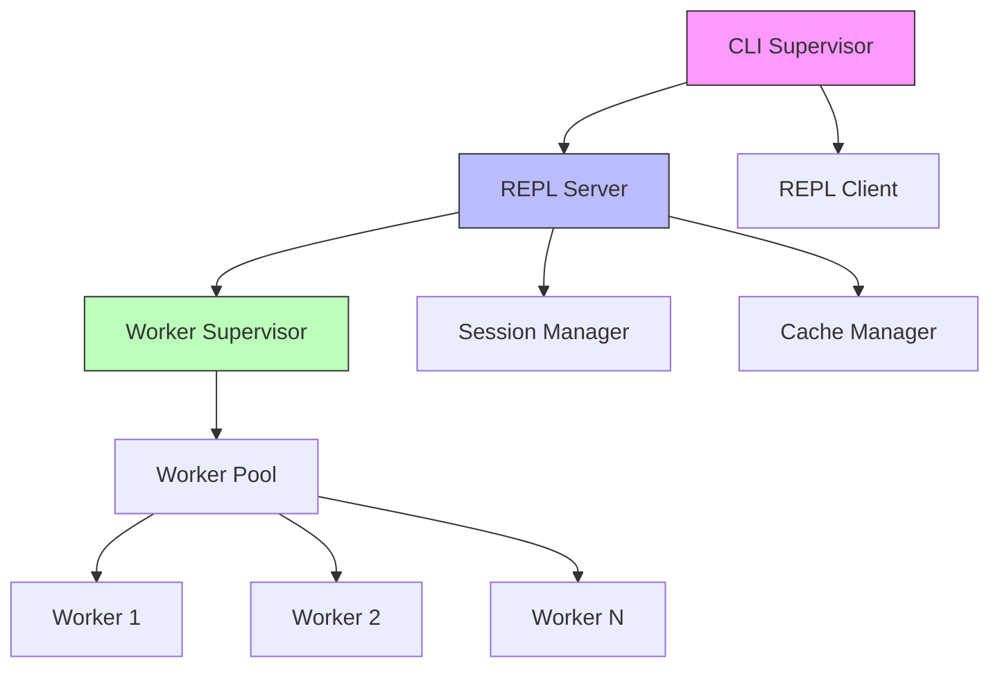

# Zylisp Architecture: Complete System Design

**Version**: 1.1.0
**Date**: October 2025
**Status**: Architectural Blueprint

---

## Table of Contents

1. [Complete System Architecture](#1-complete-system-architecture)
2. [Repository Structure](#2-repository-structure)
3. [Compilation Pipeline](#3-compilation-pipeline)
4. [Canonical S-Expression Format](#4-canonical-s-expression-format)
5. [REPL System Details](#5-repl-system-details)
6. [Memory Management & Process Supervision](#6-memory-management--process-supervision)
7. [Reliability Infrastructure](#7-reliability-infrastructure)
8. [Implementation Roadmap](#8-implementation-roadmap)
9. [Design Decisions Reference](#9-design-decisions-reference)
10. [Features Pending Additional Research](#features-pending-additional-research)
11. [Glossary](#11-glossary)

---

## 1. Complete System Architecture

### 1.1 System Overview

Zylisp is a Lisp dialect that compiles to Go, featuring high-performance REPL execution, reliability-first design with OTP-style supervision, and clean architectural separation.



### 1.2 Core Components

#### zylisp/cli

- Command-line interface for developers
- Manages REPL lifecycle
- Provides compilation tools
- Handles terminal I/O

#### zylisp/repl

- nREPL-style server/client architecture
- Session management
- Request routing
- Multi-client support

#### zylisp/lang

- Stage 1 compiler: Zylisp syntax → Core forms
- Interpreter for fast-path evaluation
- Stage 2 compiler integration: Core forms → Go code
- Compilation caching

#### zylisp/zast

- Canonical S-expression format specification
- Bidirectional Go AST ↔ S-expression conversion
- The stable "assembly language" for Go

#### zylisp/rely

- OTP-style supervision trees
- GenServer behavior patterns
- Process registry
- Built on github.com/thejerf/suture

#### zylisp/design

- Complete record of design documents
- Architecture decisions
- Planning conversations
- Feature specifications

#### zylisp/go-ast-coverage

- Comprehensive Go language test suite
- All known Go language forms as .go source files
- Pre-generated AST archives
- Used for testing zast implementation

### 1.3 Key Design Principles

1. **Two-Stage Compilation**: Clean separation between Zylisp syntax and Go interop
2. **Canonical IR**: S-expressions as intermediate representation
3. **Zero Circular Dependencies**: Clean import graph
4. **Reliability First**: Supervision from day one
5. **Process Isolation**: Solve plugin memory leaks through worker supervision
6. **Tiered Execution**: Optimize common cases (interpretation) while maintaining full compilation power
7. **Lisp-1 Namespace**: Single namespace for functions and variables (following Scheme, Clojure, and per Robert Virding's LFE design)
8. **Explicit Type Annotations**: Optional type annotations in function signatures and struct definitions for Go interop

### 1.4 Architecture Benefits

- ✅ Fast REPL experience (sub-millisecond for simple expressions)
- ✅ Production-ready memory management
- ✅ Clean separation of concerns
- ✅ Stable foundation for language evolution
- ✅ Comprehensive testing infrastructure
- ✅ Complete design documentation
- ✅ Cross-platform support (macOS, Linux, Windows)

---

## 2. Repository Structure

### 2.1 Repository Overview



### 2.2 Core Repositories

#### zylisp/cli

**Purpose**: Developer-facing executable

**Contents**:

```
zylisp/cli/
├── cmd/
│   ├── repl.go      # REPL command
│   ├── compile.go   # File compilation
│   ├── format.go    # Code formatting
│   └── version.go   # Version info
├── internal/
│   └── supervisor/  # CLI-level supervision
└── main.go
```

**Responsibilities**:

- Manages REPL server lifecycle
- Creates and manages REPL client
- Handles terminal I/O and user interaction
- Provides file compilation orchestration
- CLI tool suite (format, lint, etc.)

**Dependencies**:

- `zylisp/repl` (client only)
- `zylisp/rely` (for supervision)

#### zylisp/repl

**Purpose**: nREPL-style client/server model

**Contents**:

```
zylisp/repl/
├── server/
│   ├── server.go    # Main server implementation
│   ├── session.go   # Session management
│   ├── eval.go      # Evaluation coordination
│   └── worker.go    # Worker pool management
├── client/
│   ├── client.go    # Client library
│   └── conn.go      # Connection handling
├── protocol/
│   └── nrepl.go     # nREPL protocol
└── supervisor/
    └── worker_sup.go # Worker supervision
```

**Responsibilities**:

- REPL server with multi-client support
- Session management and isolation
- Worker process supervision
- Request routing and queuing
- Memory monitoring and worker restart

**Dependencies**:

- `zylisp/lang` (all packages)
- `zylisp/rely` (for supervision)

#### zylisp/lang

**Purpose**: The Zylisp language implementation

**Contents**:

```
zylisp/lang/
├── parser/
│   ├── lexer.go     # Tokenization
│   ├── reader.go    # Surface forms from tokens
│   └── expander.go  # Macro expansion to Core forms
├── sexpr/
│   ├── types.go     # SExpr interface, List, Symbol, etc.
│   ├── print.go     # Pretty printing
│   └── equals.go    # Structural equality
├── interpreter/
│   └── eval.go      # Direct evaluation (Tier 1)
├── compiler/
│   ├── analyze.go   # Core forms → Go AST
│   └── emit.go      # Go AST → Go source text
└── cache/
    ├── cache.go     # Compiled function storage
    ├── plugin.go    # Go plugin loading (Tier 2)
    └── builder.go   # Compilation orchestration
```

**Responsibilities**:

- Stage 1 compilation: Zylisp syntax → Core forms
- Macro expansion
- Direct interpretation (fast path)
- Stage 2 compilation: Core forms → Go code
- Compilation caching and plugin management

**Dependencies**:

- `zylisp/zast` (for Go AST conversion)

#### zylisp/zast

**Purpose**: Stable Go AST ↔ S-expression conversion layer

**Contents**:

```
zylisp/zast/
├── spec/
│   └── format.md    # Canonical format specification
├── parse/
│   └── parser.go    # S-expr → Go AST
├── generate/
│   └── generator.go # Go AST → S-expr
├── validate/
│   └── validator.go # Format validation
└── types/
    └── nodes.go     # Node type definitions
```

**Responsibilities**:

- Define canonical S-expression format
- Parse S-expressions to Go AST
- Generate S-expressions from Go AST
- Validate format compliance
- Round-trip conversion guarantees

**Dependencies**:

- Standard library only
- `go/ast`, `go/token`, `go/parser`, `go/printer`

**Characteristics**:

- Stable and rarely changes
- "Assembly language" for Go
- Well-tested and reliable
- Minimal external dependencies

#### zylisp/rely

**Purpose**: OTP-style reliability infrastructure

**Contents**:

```
zylisp/rely/
├── supervisor/
│   ├── supervisor.go # Supervision tree
│   ├── strategies.go # Restart strategies
│   └── spec.go       # Child specifications
├── genserver/
│   ├── genserver.go  # GenServer behavior
│   ├── call.go       # Synchronous calls
│   └── cast.go       # Asynchronous casts
├── registry/
│   └── registry.go   # Named process registry
└── event/
    └── bus.go        # Event subscription
```

**Responsibilities**:

- Supervision tree implementation
- GenServer behavior pattern
- Named process registry
- Synchronous call/reply patterns
- Event subscription system
- Multiple restart strategies

**Built on**:

- `github.com/thejerf/suture` (foundation)

**What we add beyond Suture**:

- GenServer behavior pattern
- Process registry with named processes
- Synchronous call/reply pattern
- Event subscription system
- Additional restart strategies (OneForAll, RestForOne, SimpleOneForOne)
- Full OTP-style behaviors

### 2.3 Supporting Repositories

#### zylisp/design

**Purpose**: Complete design documentation archive

**Contents**:

```
zylisp/design/
├── architecture/
│   ├── 001-system-overview.md
│   ├── 002-compilation-pipeline.md
│   ├── 003-repl-architecture.md
│   └── ...
├── decisions/
│   ├── 001-two-stage-compilation.md
│   ├── 002-canonical-sexpr-format.md
│   ├── 003-worker-supervision.md
│   └── ...
├── specifications/
│   ├── canonical-sexpr-spec.md
│   ├── nrepl-protocol.md
│   └── ...
├── conversations/
│   ├── 2025-10-01-repl-performance.md
│   ├── 2025-10-02-memory-management.md
│   └── ...
└── README.md
```

**Contents Type**:

- Architecture documents
- Design decision records (ADRs)
- Technical specifications
- Planning conversations
- Feature proposals
- Implementation notes

**Purpose**:

- Historical record of all design decisions
- Context for why things are the way they are
- Reference for future development
- Onboarding documentation for contributors

#### zylisp/go-ast-coverage

**Purpose**: Comprehensive Go language test coverage

**Contents**:

```
zylisp/go-ast-coverage/
├── source/
│   ├── basics/
│   │   ├── hello_world.go
│   │   ├── variables.go
│   │   ├── functions.go
│   │   └── ...
│   ├── control_flow/
│   │   ├── if_statements.go
│   │   ├── for_loops.go
│   │   ├── switch.go
│   │   └── ...
│   ├── types/
│   │   ├── structs.go
│   │   ├── interfaces.go
│   │   ├── arrays_slices.go
│   │   └── ...
│   └── advanced/
│       ├── goroutines.go
│       ├── channels.go
│       ├── generics.go
│       └── ...
├── ast_archives/
│   ├── basics/
│   │   ├── hello_world.ast
│   │   ├── variables.ast
│   │   └── ...
│   └── ...
├── tools/
│   ├── generate_ast.go  # Tool to regenerate AST files
│   └── validate.go      # Validation tool
└── README.md
```

**Purpose**:

- Provides comprehensive test cases for zast implementation
- All known Go language forms as compilable source
- Pre-generated AST representations for comparison
- Ensures zast handles all Go constructs
- Reference for implementing new features

**Usage**:

```go
// In zast tests
func TestRoundTrip(t *testing.T) {
    testCases := coverage.LoadAllTestCases()
    for _, tc := range testCases {
        // Parse Go source to AST
        goAST := parseGoSource(tc.Source)

        // Convert to S-expression
        sexpr := zast.Generate(goAST)

        // Convert back to AST
        reconstructed := zast.Parse(sexpr)

        // Compare with archived AST
        if !astEqual(reconstructed, tc.ArchivedAST) {
            t.Errorf("Round trip failed for %s", tc.Name)
        }
    }
}
```

### 2.4 Dependency Graph

```
zylisp/cli
  ├─> zylisp/repl (client only)
  └─> zylisp/rely

zylisp/repl
  ├─> zylisp/lang
  └─> zylisp/rely

zylisp/lang
  └─> zylisp/zast

zylisp/zast
  └─> (standard library only)

zylisp/rely
  └─> github.com/thejerf/suture

zylisp/design
  └─> (no dependencies)

zylisp/go-ast-coverage
  └─> (standard library only)
```

**Key Properties**:

- ✅ Zero circular dependencies
- ✅ Clear layering
- ✅ Reusable components
- ✅ Testable in isolation

---

## 3. Compilation Pipeline

### 3.1 Unified Compilation Flow



### 3.2 Stage Boundaries

#### Stage 1: Zylisp Syntax → Core Forms

**Location**: `zylisp/lang/parser`

**Process**:

1. **Lexer** (`lexer.go`): Source text → Tokens
2. **Reader** (`reader.go`): Tokens → Surface forms
3. **Expander** (`expander.go`): Surface forms → Core forms (macro expansion)

**Input**: Zylisp source code

```zylisp
(deffunc add (a b)
  (:args integer integer)
  (:return integer)
  (+ a b))
```

**Output**: Core forms (canonical S-expressions)

```lisp
(deffunc add (a b)
  (:args integer integer)
  (:return integer)
  (+ a b))
```

*Note: In this simple case, surface and core forms are identical. More complex macros would show differences.*

#### Stage 2: Core Forms → Go Code

**Location**: `zylisp/lang/compiler` + `zylisp/zast`

**Process**:

1. **Analyze** (`compiler/analyze.go`): Core forms → Go AST (uses zast types)
2. **Emit** (`compiler/emit.go`): Go AST → Go source text
3. **Build** (Go toolchain): Go source → Binary/Plugin

**Input**: Core forms

```lisp
(deffunc add (a b)
  (:args integer integer)
  (:return integer)
  (+ a b))
```

**Intermediate**: Go AST (via zast)

```lisp
(FuncDecl
  :name (Ident :name "add")
  :type (FuncType
          :params (FieldList
                    :list ((Field :names ((Ident :name "a"))
                                  :type (Ident :name "int"))
                           (Field :names ((Ident :name "b"))
                                  :type (Ident :name "int"))))
          :results (FieldList
                     :list ((Field :type (Ident :name "int")))))
  :body (BlockStmt ...))
```

**Output**: Go source code

```go
func add(a int, b int) int {
    return a + b
}
```

### 3.3 REPL-Specific Compilation Path

#### Tier 1: Direct Interpretation

**When Used**:

- Literals: `42`, `"hello"`, `true`
- Simple arithmetic: `(+ 1 2)`
- Variable lookups
- List/vector construction of literals

**Implementation**: `zylisp/lang/interpreter/eval.go`

**Performance**: ~1ms

**Example**:

```zylisp
(+ 1 2)  ; Direct evaluation → 3
```

#### Tier 2: Cached Compilation

**When Used**:

- Previously compiled functions
- Precompiled standard library

**Implementation**: `zylisp/lang/cache/`

**Process**:

1. Check cache for function signature
2. If found, execute directly
3. No compilation needed

**Performance**: ~0ms (direct function call)

**Example**:

```zylisp
(deffunc square (x)
  (:args integer)
  (:return integer)
  (* x x))  ; First time: compile & cache

(square 5)  ; Subsequent: cached execution
```

#### Tier 3: JIT Compilation

**When Used**:

- Complex expressions not in cache
- New function definitions
- Dynamic code generation

**Implementation**: Full compilation pipeline

**Process**:

1. Core forms → Go AST (via `zast`)
2. Go AST → Go source
3. `go build -buildmode=plugin`
4. Load plugin
5. Cache function
6. Execute

**Performance**: 50-200ms (first time), then cached

**Memory Management**: Worker process isolation (see Section 6)

### 3.4 File-Based Compilation Path

**Command**: `zylisp compile myfile.zl`

**Process**:

1. Read source file
2. Parse to surface forms
3. Expand macros to core forms
4. Compile to Go AST (via zast)
5. Generate Go source
6. Write `.go` file
7. Invoke `go build` for binary

**Output**: Standalone executable

**No REPL-specific optimizations**:

- No tiered execution
- No caching
- No plugin loading
- Straight compilation to binary

---

## 4. Canonical S-Expression Format

### 4.1 Overview

The canonical S-expression format provides a 1:1 bidirectional mapping between Go AST nodes and S-expressions. This format serves as Zylisp's intermediate representation.

**Design Principles**:

1. **Faithful Representation**: Every field in Go's AST is represented
2. **Position Preservation**: All `token.Pos` information is maintained
3. **Self-Contained**: FileSet information is embedded
4. **Keyword Arguments**: Explicit field names for clarity
5. **Go Semantics**: Use `nil` for null values

### 4.2 File Structure

```lisp
(Program
  :fileset (FileSet ...)
  :files ((File ...) ...))
```

**FileSet Representation**:

```lisp
(FileSet
  :base 1
  :files (
    (FileInfo
      :name "main.go"
      :base 1
      :size 150
      :lines (1 15 30 45 60 75 90 105 120 135 150))))
```

### 4.3 Core Syntax Rules

**Node Format**:

```lisp
(NodeType :field1 value1 :field2 value2 ...)
```

**Position Fields**: Integers (0 = no position)

**Nil Values**: Use `nil` explicitly

**Lists**: Nested S-expressions

### 4.4 Phase 1 Node Types

#### File

```lisp
(File
  :package <pos>
  :name <Ident>
  :decls (<Decl> ...)
  :scope <Scope>
  :imports (<ImportSpec> ...)
  :unresolved (<Ident> ...)
  :comments (<CommentGroup> ...))
```

#### Ident

```lisp
(Ident :namepos <pos> :name <string> :obj <Object>)
```

#### BasicLit

```lisp
(BasicLit :valuepos <pos> :kind <token> :value <string>)
```

Token kinds: `INT`, `FLOAT`, `IMAG`, `CHAR`, `STRING`

#### GenDecl

```lisp
(GenDecl
  :doc <CommentGroup>
  :tok <token>
  :tokpos <pos>
  :lparen <pos>
  :specs (<Spec> ...)
  :rparen <pos>)
```

Tokens: `IMPORT`, `CONST`, `TYPE`, `VAR`

#### FuncDecl

```lisp
(FuncDecl
  :doc <CommentGroup>
  :recv <FieldList>
  :name <Ident>
  :type <FuncType>
  :body <BlockStmt>)
```

#### Complete Node Reference

See `zylisp/zast/spec/format.md` for complete specification of all node types.

### 4.5 Example: Hello World

**Go Source**:

```go
package main

import "fmt"

func main() {
    fmt.Println("Hello, world!")
}
```

**Canonical S-Expression** (abbreviated):

```lisp
(Program
  :fileset (FileSet :base 1
             :files ((FileInfo :name "main.go" :base 1 :size 78
                               :lines (1 14 27 42 78))))
  :files (
    (File
      :package 1
      :name (Ident :namepos 9 :name "main" :obj nil)
      :decls (
        (GenDecl :tok IMPORT :tokpos 15
          :specs ((ImportSpec
                    :path (BasicLit :valuepos 22 :kind STRING
                                    :value "\"fmt\""))))
        (FuncDecl
          :name (Ident :namepos 33 :name "main")
          :type (FuncType :func 28
                  :params (FieldList :opening 37 :list () :closing 38))
          :body (BlockStmt :lbrace 40
                  :list ((ExprStmt
                           :x (CallExpr
                                :fun (SelectorExpr
                                       :x (Ident :name "fmt")
                                       :sel (Ident :name "Println"))
                                :lparen 57
                                :args ((BasicLit :valuepos 58 :kind STRING
                                                :value "\"Hello, world!\""))
                                :rparen 74)))
                  :rbrace 76))))))
```

---

## 5. REPL System Details

### 5.1 nREPL-Style Architecture



### 5.2 Multi-Client Support

**Features**:

- Multiple clients can connect to single server
- Session isolation per client
- Shared standard library across sessions
- Independent environments per session

### 5.3 Server Components

**Session Manager**:

- Creates isolated evaluation environments
- Tracks client connections
- Routes requests to correct session

**Worker Pool**:

- Maintains pool of worker processes
- Load balancing across workers
- Health monitoring

**Supervisor**:

- Monitors worker memory usage
- Restarts workers when necessary
- Handles worker crashes gracefully

---

## 6. Memory Management & Process Supervision

### 6.1 The Plugin Memory Leak Problem

Go plugins (`-buildmode=plugin`) **cannot be unloaded** once loaded. This creates memory leaks in long-running REPL sessions.

**Why plugins can't be unloaded**:

- Compiled as shared libraries (`.so` files)
- Loaded into process address space
- Go runtime doesn't support unloading
- Memory remains allocated until process terminates

### 6.2 Solution: Worker Process Isolation



**Why Process Isolation Works**:

- ✅ True memory isolation
- ✅ Can forcibly kill worker
- ✅ Worker crashes don't affect supervisor
- ✅ Easy external memory monitoring
- ✅ Actually reclaims plugin memory

**Why Goroutines Don't Work**:

- ❌ Share process address space
- ❌ Plugins leak in same process
- ❌ Cannot forcibly kill goroutine
- ❌ Doesn't solve the problem

### 6.3 Memory Monitoring with gopsutil

**Cross-platform solution**:

```go
import "github.com/shirou/gopsutil/v3/process"

func getProcessMemoryMB(pid int) (uint64, error) {
    proc, err := process.NewProcess(int32(pid))
    if err != nil {
        return 0, err
    }

    memInfo, err := proc.MemoryInfo()
    if err != nil {
        return 0, err
    }

    return memInfo.RSS / 1024 / 1024, nil
}
```

**Platform Support**:

| Approach | macOS | Linux | Windows | External Deps |
|----------|-------|-------|---------|---------------|
| `runtime.MemStats` | ✅ | ✅ | ✅ | No |
| `/proc` parsing | ❌ | ✅ | ❌ | No |
| `gopsutil` | ✅ | ✅ | ✅ | Yes (minimal) |

**Decision**: Use `gopsutil` for cross-platform compatibility

### 6.4 Restart Triggers

**Supervisor restarts worker when**:

1. Memory exceeds threshold (e.g., 500MB)
2. Request count exceeds limit (e.g., 1000 requests)
3. Worker crashes or becomes unresponsive

### 6.5 Implementation

```go
type Supervisor struct {
    worker          *Worker
    memThresholdMB  uint64
    maxRequests     int
    requestCount    int
}

type Worker struct {
    cmd     *exec.Cmd
    pid     int32
    conn    net.Conn
}

func (s *Supervisor) Execute(code string) (string, error) {
    if s.shouldRestart() {
        s.restartWorker()
    }

    result, err := s.worker.SendRequest(code)
    s.requestCount++
    return result, err
}

func (s *Supervisor) shouldRestart() bool {
    if s.requestCount >= s.maxRequests {
        return true
    }

    proc, err := process.NewProcess(s.worker.pid)
    if err != nil {
        return true
    }

    memInfo, err := proc.MemoryInfo()
    if err != nil {
        return true
    }

    return memInfo.RSS / 1024 / 1024 > s.memThresholdMB
}

func (s *Supervisor) restartWorker() {
    if s.worker != nil {
        s.worker.Kill()
    }

    s.worker = s.spawnWorker()
    s.requestCount = 0
}
```

### 6.6 IPC Protocol

**Unix Domain Sockets**:

```go
type Request struct {
    Code string
    ID   int
}

type Response struct {
    Result string
    Error  string
}
```

**Benefits**:

- Low latency
- Process boundary enforcement
- Simple protocol
- Easy to kill worker without cleanup

---

## 7. Reliability Infrastructure

### 7.1 Supervision Tree



### 7.2 Integration with rely/Suture

```go
func main() {
    sup := rely.NewSupervisor(rely.OneForOne)

    sup.AddChild(rely.ChildSpec{
        ID:      "repl-server",
        Start:   startREPLServer,
        Restart: rely.Permanent,
    })

    sup.AddChild(rely.ChildSpec{
        ID:      "repl-client",
        Start:   startREPLClient,
        Restart: rely.Permanent,
    })

    if err := sup.Start(context.Background()); err != nil {
        log.Fatal(err)
    }
}
```

### 7.3 Restart Strategies

**OneForOne**: When a child crashes, only that child is restarted

**OneForAll**: When any child crashes, all children are restarted

**RestForOne**: When a child crashes, that child and all children started after it are restarted

**SimpleOneForOne**: Dynamic worker pool with identical workers

### 7.4 GenServer Pattern

```go
type GenServer interface {
    Init() error
    HandleCall(request interface{}) (interface{}, error)
    HandleCast(message interface{}) error
    Terminate() error
}

func (gs *MyServer) HandleCall(req interface{}) (interface{}, error) {
    switch r := req.(type) {
    case EvalRequest:
        return gs.eval(r.Code)
    default:
        return nil, errors.New("unknown request")
    }
}
```

---

## 8. Implementation Roadmap

### Phase 1: Foundation (Weeks 1-2)

1. **Build zylisp/zast**
   - Implement canonical S-expression parser
   - Implement Go AST → S-expression generator
   - Implement S-expression → Go AST converter
   - Test against go-ast-coverage
   - Validate round-trip conversion

2. **Set up repositories**
   - Initialize all core repos
   - Set up CI/CD
   - Documentation structure

3. **Basic zylisp/lang**
   - Lexer and parser
   - Surface forms → Core forms
   - Basic macro expansion

4. **Basic REPL**
   - Server skeleton
   - Client library
   - Simple evaluation (no optimization)

### Phase 2: Optimization (Weeks 3-4)

5. **Tier 1: Interpreter**
   - Simple expression detection
   - Direct evaluation

6. **Tier 2: Caching**
   - Plugin compilation
   - Function caching
   - Cache lookup

7. **Profile and optimize**
   - Benchmark tiers
   - Optimize hot paths

### Phase 3: Reliability (Weeks 5-6)

8. **Build zylisp/rely**
   - Wrap Suture
   - GenServer pattern
   - Process registry

9. **Worker supervision**
   - Supervisor process
   - Memory monitoring
   - Worker restart logic

10. **Integration**
    - Wire up full supervision tree
    - Test failure scenarios

### Phase 4: Polish (Weeks 7-8)

11. **UX improvements**
    - Progress indicators
    - Error messages
    - Session management

12. **Documentation**
    - Complete all design docs
    - API documentation
    - User guides

---

## 9. Design Decisions Reference

### 9.1 Core Architecture

| Decision | Rationale |
|----------|-----------|
| Two-stage compilation | Clean separation: syntax → IR → target |
| Canonical S-expressions as IR | Perfect for interpretation and compilation |
| Three-tier execution | Optimize common cases, maintain full power |
| Worker process isolation | Only way to solve plugin memory leak |
| Supervised workers | Automatic recovery from failures |

### 9.2 Naming Conventions

| Decision | Rationale |
|----------|-----------|
| `deffunc` not `defn` | Go-inspired naming (func not fn) |
| `zast` not `go-sexp-ast` | Shorter, clearer purpose |
| "Core forms" in docs | More accessible than "IR" |
| "Surface syntax" for input | Clear distinction from Core forms |

### 9.3 Repository Organization

| Decision | Rationale |
|----------|-----------|
| Separate repos for each component | Zero circular dependencies |
| `zast` as separate repo | Stable foundation, reusable |
| `rely` as separate library | Reusable beyond Zylisp |
| `design` repo for documentation | Complete historical record |
| `go-ast-coverage` for testing | Comprehensive test coverage |

### 9.4 REPL Architecture

| Decision | Rationale |
|----------|-----------|
| nREPL-style client/server | Multi-client support, standard protocol |
| Tiered execution | Sub-millisecond responses for simple cases |
| Plugin-based caching | Native Go mechanism |
| Memory monitoring with gopsutil | Cross-platform, reliable |

### 9.5 Memory Management

| Decision | Rationale |
|----------|-----------|
| Process isolation for workers | True memory isolation |
| Unix sockets for IPC | Clean boundary, low latency |
| Restart on memory threshold | Predictable memory usage |
| gopsutil for monitoring | Works on macOS, Linux, Windows |

### 9.6 Reliability

| Decision | Rationale |
|----------|-----------|
| Build on Suture | Battle-tested foundation |
| Supervision from day one | Core philosophy |
| GenServer pattern | Familiar to Erlang/Elixir developers |
| Language-level support | Not bolted-on |

---

## 10. Features Pending Additional Research

### Pattern Matching

TBD

### Data Immutability

#### Core Challenges

Language-Level Issues:

- No Immutability Primitives
- Reference Semantics for Collections
- Value vs Reference Confusion

Practical Runtime Issues:

- Garbage Collection Pressure
- Memory Overhead
- Closure Capture Semantics

#### Potential Solutions

- Structural Sharing with Persistent Data Structures
- Opaque Type Wrappers
- Copy-on-Write Strategies
- Code Generation and Tooling

#### Areas for Additional Research

- Performance Benchmarking
- Persistent Data Structure Implementations
- Thread Safety and Concurrency
- Interop with Go Ecosystem
- Memory Management Strategies
- Formal Verification
- Language Feature Investigation

---

## 11. Glossary

### Compilation Terms

**AST (Abstract Syntax Tree)**
Tree representation of source code structure. In Zylisp, specifically refers to Go's AST from the `go/ast` package.

**Canonical S-Expression**
The normalized, fully-expanded S-expression format that serves as Zylisp's intermediate representation. All macros have been expanded, all syntactic sugar removed.

**Core Forms**
Synonym for canonical S-expressions. The normalized representation after macro expansion. Called "core" because these are the core language constructs.

**Go AST**
The Abstract Syntax Tree representation from Go's `go/ast` package. The target of Stage 2 compilation.

**IR (Intermediate Representation)**
Standard compiler terminology for the form between source and target languages. In Zylisp, the IR is the canonical S-expression format.

**Lisp-1**
Namespace design where functions and variables share the same namespace (as in Scheme, Clojure, and LFE). Contrasts with Lisp-2 (Common Lisp) which has separate namespaces. Zylisp follows the Lisp-1 design per Robert Virding's recommendations for LFE.

**Macro Expansion**
The process of transforming surface forms (which may include macros and syntactic sugar) into core forms (which contain only primitive constructs).

**S-Expression (Symbolic Expression)**
A notation for nested list structures, written as `(operator operand1 operand2 ...)`. The fundamental data structure in Lisp languages.

**Stage 1 Compilation**
The first compilation stage: Zylisp source → Core forms (IR). Handles parsing, macro expansion, and normalization.

**Stage 2 Compilation**
The second compilation stage: Core forms → Go AST → Go code. Handles code generation and Go compilation.

**Surface Forms**
The parsed S-expressions as they appear in source code, before macro expansion. May include macros, reader macros, and syntactic sugar.

**Surface Syntax**
What users actually write in `.zl` files. May include macros and syntactic conveniences that get expanded away during compilation.

**Type Annotation**
Optional type information in Zylisp code that specifies types for function parameters, return values, and struct fields. Uses keyword syntax like `:args`, `:return`, and `:field`. Required for Go interop but optional for pure Zylisp code.

**Zylisp Source**
The textual source code written by users in `.zl` files.

### REPL Terms

**Cache**
Storage for compiled functions as Go plugins. Allows instant re-execution without recompilation.

**Direct Interpretation**
Tier 1 execution: Evaluating simple expressions without compilation. Used for literals and basic operations.

**JIT (Just-In-Time) Compilation**
Tier 3 execution: Compiling code on-demand during program execution. In Zylisp, happens when an expression is too complex for interpretation and not in the cache.

**nREPL**
Network REPL protocol originally from Clojure. Allows multiple clients to connect to a single REPL server.

**Plugin**
A dynamically loaded shared library (`.so` file on Linux/macOS, `.dll` on Windows). Go plugins cannot be unloaded once loaded.

**REPL (Read-Eval-Print Loop)**
Interactive programming environment that reads expressions, evaluates them, prints results, and loops.

**Session**
An isolated evaluation environment for a single REPL client. Multiple sessions can coexist on the same server.

**Tier 1 Execution**
Direct interpretation of simple expressions. ~1ms latency.

**Tier 2 Execution**
Execution of cached compiled functions. ~0ms latency (direct function call).

**Tier 3 Execution**
JIT compilation and execution. 50-200ms first time, then cached.

**Worker Process**
A separate OS process that loads plugins and executes compiled code. Can be killed to reclaim memory.

### Memory Management Terms

**gopsutil**
Cross-platform library for process and system monitoring. Used to monitor worker memory usage.

**IPC (Inter-Process Communication)**
Communication between separate processes. Zylisp uses Unix domain sockets for supervisor-worker IPC.

**Memory Leak**
Memory that is allocated but cannot be reclaimed. Go plugins create memory leaks because they cannot be unloaded.

**Process Isolation**
Running code in separate OS processes so one process's memory is completely isolated from another's.

**RSS (Resident Set Size)**
The amount of physical RAM a process is currently using. Used to monitor worker memory usage.

**Supervisor**
A process that monitors and manages worker processes. Restarts workers when they crash or exceed memory limits.

**Unix Domain Socket**
A socket for IPC on the same machine. Lower overhead than TCP, provides process boundary.

**Worker**
A disposable process that loads plugins and executes code. Supervised and restarted as needed.

### Reliability Terms

**Behavior**
A design pattern or interface that defines how a process should respond to events. GenServer is a behavior.

**Child Specification**
Configuration for how a supervisor should start and manage a child process.

**GenServer**
"Generic Server" behavior pattern from Erlang/OTP. Handles synchronous and asynchronous messages.

**OneForAll**
Restart strategy where if any child crashes, all children are restarted.

**OneForOne**
Restart strategy where only the crashed child is restarted.

**OTP (Open Telecom Platform)**
Erlang's framework for building reliable, fault-tolerant systems. Zylisp adopts OTP patterns via the rely library.

**Process Registry**
A system for naming and looking up processes by name rather than PID.

**RestForOne**
Restart strategy where a crashed child and all children started after it are restarted.

**Restart Strategy**
Policy determining which processes to restart when a child crashes.

**SimpleOneForOne**
Restart strategy for dynamic worker pools where all workers are identical.

**Supervision Tree**
Hierarchical organization of processes where supervisors monitor and restart child processes.

**Suture**
Go library implementing Erlang-style supervision trees. Foundation of zylisp/rely.

### Repository Terms

**go-ast-coverage**
Repository containing comprehensive Go language test cases with pre-generated AST archives.

**rely**
Zylisp's reliability infrastructure library. Provides supervision trees, GenServer, and process management.

**zast**
Zylisp's AST conversion library. Handles bidirectional conversion between canonical S-expressions and Go AST.

### Go-Specific Terms

**Go Plugin**
A shared library compiled with `-buildmode=plugin` that can be loaded at runtime using the `plugin` package.

**token.Pos**
Integer type in Go's AST representing a position in source code as a byte offset.

### Architecture Terms

**Circular Dependency**
When package A imports package B, and package B imports package A (directly or indirectly). Zylisp architecture has zero circular dependencies.

**Clean Architecture**
Design approach emphasizing separation of concerns, dependency management, and testability.

**Dependency Graph**
Visual representation of which packages depend on which other packages.

**Layered Architecture**
Design where components are organized in layers, with each layer depending only on layers below it.

---

## Conclusion

Zylisp's architecture provides a solid foundation for a production-ready Lisp that compiles to Go:

- **Two-stage compilation** enables independent evolution of syntax and code generation
- **Tiered REPL execution** delivers sub-millisecond responses for common cases
- **Process supervision** solves the plugin memory leak problem
- **Clean repository structure** ensures zero circular dependencies
- **Comprehensive testing infrastructure** validates implementation against all Go constructs
- **Complete design documentation** preserves architectural decisions

The architecture balances pragmatism (proven tools like Suture and gopsutil) with vision (language-level reliability like Erlang), providing a clear path from prototype to production.

---

**Version History**

- **1.1.0** (October 2025) - Complete unified architecture with all repositories, compilation flow, and glossary
